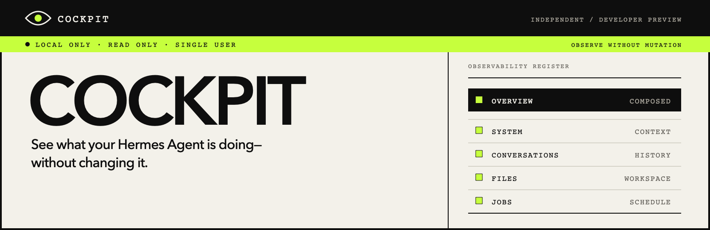

<p align="center">
  
</p>

# Cockpit

**A local, read-only dashboard for your agents.**

[](https://github.com/swen-chan/cockpit/actions/workflows/verify.yml)
[](LICENSE)


Cockpit brings local agent activity, conversations or development tasks,
current context, and approved workspace files into one browser interface.
Available views depend on the agent; scheduled jobs are a Hermes feature.
Cockpit does not send messages, resume tasks, edit files, control jobs, or
create a second persistent application database.

> [!IMPORTANT]
> **v0.2.0 is a developer preview, not universal agent support.** The Hermes preset
> targets [Hermes Agent v0.21.2](https://github.com/NousResearch/hermes-agent/releases/tag/v2026.9.11)
> (release `v2026.9.11`). Codex integration is pinned to Codex CLI `0.145.0`.
> Automated regression tests use synthetic data; limited local acceptance is
> not a guarantee for other installations. There is no import wizard or
> automatic source discovery.

See the [v0.2.0 release notes](docs/releases/v0.2.0.md) for changes,
installation instructions, and known limits.

Cockpit is an independent open-source project. It is not affiliated with or
endorsed by [Nous Research](https://nousresearch.com/), the
[Hermes Agent](https://github.com/NousResearch/hermes-agent) project, or OpenAI.

## What you can inspect

| View                      | Hermes Agent                                          | Codex preview                                                                       |
| ------------------------- | ----------------------------------------------------- | ----------------------------------------------------------------------------------- |
| **Overview**              | Recent activity and source status                     | Task index and available source status                                              |
| **System**                | Profile, context, skills, tools, and source documents | Current approved guidance documents, not a reconstruction of past task instructions |
| **Conversations / Tasks** | Eligible interactive conversations                    | Tasks with project labels, messages, and folded, filtered Process activity          |
| **Files**                 | Files inside the approved Hermes workspace            | Optional; only inside a separately approved Codex workspace                         |
| **Jobs**                  | Scheduled jobs and observed runs                      | Not available                                                                       |

Every surface is intentionally bounded and read-only. Source failures stay
local to the affected section instead of taking down the entire interface.
An agent's presence does not imply every view is available. Tasks are units of
work, not project folders; a task's project label does not grant Files access.

## Developer setup

### Requirements

- Node.js 24 or newer
- pnpm 10.28.1
- For Hermes: Hermes Agent v0.21.2 (`v2026.9.11`), or a custom source manifest
- For Codex: macOS or Linux, an existing local Codex home, and a trusted Codex
  CLI **exactly `0.145.0`** on the `PATH` used to start Cockpit. Other versions
  are rejected by this preview; installing the desktop app alone is not this
  prerequisite. Check with `codex --version`.

Clone and install:

```bash
git clone https://github.com/swen-chan/cockpit.git
cd cockpit
pnpm install
```

### Choose your local sources

Create an ignored `.env.local` using one of the options below. Replace the
example paths with your own absolute paths; do not use a literal `~`.
Neither agent requires the other to be installed.

#### Hermes only

```dotenv
COCKPIT_WORKSPACE_ROOT=/absolute/path/to/your/hermes/workspace
COCKPIT_SOURCE_PRESET=hermes-v2026.9.11
# Optional: explicitly select a custom or named Hermes home.
# COCKPIT_HERMES_HOME=/absolute/path/to/your/.hermes/profiles/profile-name
```

The preset supplies Cockpit's database, table, and field mappings. You still
choose `COCKPIT_WORKSPACE_ROOT` explicitly because it grants Files access to
that directory; Cockpit never infers this permission from conversation data.

#### Codex only (preview)

```dotenv
COCKPIT_CODEX_HOME=/absolute/path/to/your/.codex
# Optional: grant Files and workspace-guidance access to one project directory.
# COCKPIT_CODEX_WORKSPACE_ROOT=/absolute/path/to/your/project
```

This shows Overview, System, and Tasks. Files appears only when
`COCKPIT_CODEX_WORKSPACE_ROOT` is explicitly configured; there is no Codex Jobs
view. Choose a narrow workspace, not your entire home directory. The configured
Codex home must already contain the supported local task database and history;
Cockpit does not create, import, or repair them.

Current `AGENTS.override.md` / `AGENTS.md` guidance is inspected from the Codex
home and, when configured, the approved workspace. An optional
`COCKPIT_CODEX_CUSTOM_GUIDANCE` names one relative file inside that workspace;
it is not a new absolute-path permission or a claim that Codex used that file
in a past task.

#### Hermes and Codex together

```dotenv
COCKPIT_WORKSPACE_ROOT=/absolute/path/to/your/hermes/workspace
COCKPIT_SOURCE_PRESET=hermes-v2026.9.11
COCKPIT_CODEX_HOME=/absolute/path/to/your/.codex
# Optional: grant Codex Files access independently of the Hermes workspace.
# COCKPIT_CODEX_WORKSPACE_ROOT=/absolute/path/to/your/codex/project
# Optional: initial fallback when there is no valid remembered selection.
COCKPIT_DEFAULT_PANEL=hermes
```

Use the Agent switcher to change panels. Opening `/` remembers the last
successfully opened panel in that browser; there is no mandatory startup picker.
An explicit `/agents/hermes` or `/agents/codex` URL takes priority. Without a
valid remembered selection, the default is Hermes when both are configured,
or Codex when it is the only panel. `COCKPIT_DEFAULT_PANEL` can override that
fallback with a configured panel's name (`hermes` or `codex`).

### Start Cockpit

```bash
pnpm dev
```

Open [http://127.0.0.1:3000](http://127.0.0.1:3000). Check the configured panel's
available views, then open a conversation or task to inspect its details.
Restart Cockpit after changing `.env.local`. If your browser or shell uses a
proxy, bypass it for `localhost`, `127.0.0.1`, and `::1`.

> [!WARNING]
> Do not expose Cockpit through a LAN binding, port forward, tunnel, or reverse
> proxy. It is designed for one trusted operator on the same machine.

<details>
<summary><strong>Hermes custom layouts and configuration notes</strong></summary>

If your Hermes layout is not the supported preset, copy
`cockpit.local.example.json` to the ignored `cockpit.local.json`, replace its
synthetic mappings with your local layout, and set:

```dotenv
COCKPIT_SOURCE_MANIFEST=/absolute/path/to/this/checkout/cockpit.local.json
```

Set exactly one of `COCKPIT_SOURCE_PRESET` and `COCKPIT_SOURCE_MANIFEST`.
Cockpit never combines them or falls back from an invalid explicit choice.
Never commit the real manifest, `.env.local`, credentials, database files, or
local source content.

`promptTable` and `promptColumns` are an optional pair and require
`sessionColumns.promptHash`. The complete `messages` and `jobs` groups can be
omitted, but their corresponding surfaces will be unavailable. Keep and map
them for the full five-surface experience.

Hermes home resolution follows this order:

1. `COCKPIT_HERMES_HOME`
2. `HERMES_HOME`
3. the profile named by `~/.hermes/active_profile`
4. the default `~/.hermes` home

For the Hermes panel, `COCKPIT_WORKSPACE_ROOT` is a separate, mandatory approved
root for Files and workspace-owned System documents. It does not grant Codex
workspace access.

</details>

## Privacy and security

- Cockpit binds to `127.0.0.1` and does not provide authentication or TLS.
- Hermes sources are opened through server-only, bounded, read-only adapters.
- Codex task inspection uses bounded, disposable local snapshots. App Server
  receives only Cockpit-owned copies; Cockpit never resumes a task or converts
  the original history. See the [Codex reader notes](docs/codex-paginated-history.md).
- Browser responses are constructed from strict allowlists; credential files,
  raw configuration, raw tool payloads, and private persistence mappings are
  excluded.
- Markdown and HTML-like content is rendered inertly. Remote images and active
  HTML are not loaded.

SQLite may create an empty `-wal` file or create/update a disposable `-shm`
wal-index while a source is opened with `SQLITE_OPEN_READONLY` and `query_only`.
This narrow coordination behavior does not permit Cockpit to change a main
database, an existing non-empty WAL, business records, or other agent content.

Read [SECURITY.md](SECURITY.md) before changing the trust boundary, and use its
private reporting channel for potential vulnerabilities. Do not publish tokens,
local paths, conversations, databases, or private configuration in an issue.

## Local production build

Build first, then start the same loopback-only application:

```bash
pnpm build
pnpm start
```

This runs on your computer; it does not publish the dashboard or your agent data
to the internet.

## Development and verification

```bash
pnpm format
pnpm verify
pnpm exec playwright install chromium  # first browser-test setup only
pnpm test:browser
```

`pnpm format` applies the repository's pinned Prettier rules. `pnpm verify`
checks formatting, types, ESLint with zero warnings, unit/integration tests, and
the production build. Installing dependencies also configures a pre-commit hook
that runs ESLint and Prettier only on staged files. The browser suite runs
Chromium flows against temporary synthetic Agent environments; it refuses to
reuse a real server on port 3000.

For a focused issue or pull request, keep changes inside the current local,
read-only, single-user boundary, run both verification commands, and never
attach real agent data or machine-specific configuration.

The implemented requirements, technical design, and acceptance history live in
[`specs/cockpit-v0.1`](specs/cockpit-v0.1/) and
[`specs/cockpit-v0.2-codex`](specs/cockpit-v0.2-codex/). These retain their
version-specific scope and acceptance history. Published previews are listed
in [GitHub Releases](https://github.com/swen-chan/cockpit/releases); `main` may
contain newer development work. A release aligns `package.json`, an immutable
version tag, and release notes. Merging a PR does not publish a release by itself.

<details>
<summary><strong>Known limitations</strong></summary>

- Cockpit supports one trusted local operator and has no authentication or TLS.
  Multiple agent panels do not add multi-user access.
- The built-in preset targets Hermes Agent v0.21.2 release `v2026.9.11`.
  Other layouts require the advanced custom manifest and remain best-effort
  developer integrations.
- Codex preview requires CLI `0.145.0` and the supported local storage layout.
  Paginated task details show local recorded history only; inherited history
  is not followed. Process is a filtered activity view, not an unrestricted
  raw log: raw reasoning, command strings, and tool arguments are not exposed.
- Source reads can observe different times while an agent is changing. Codex
  copies are per-operation snapshots, not a shared cross-agent snapshot.
  A busy source may require a manual retry; automatic retry is not implemented.
- Lists and previews are deliberately bounded. Unsupported, binary, and
  oversized workspace files expose metadata only. Codex task rollout files
  over 32 MiB fail explicitly rather than loading without a limit.
- Cross-conversation search, stable row-level deep links, mutation controls,
  remote access, cloud hosting, and multi-user operation remain out of scope.
- All dates currently display in the fixed `Asia/Shanghai` time zone.

Any future remote, multi-user, browser-configurable-source, plugin-controlled,
or elevated-privilege mode requires a new threat model and containment review
before implementation.

</details>

## License

[MIT](LICENSE) © 2026 swen-chan.
