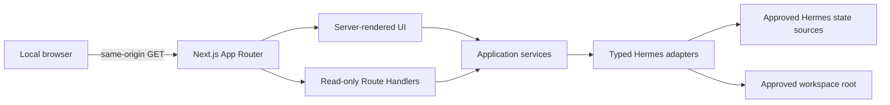

# Cockpit v0.1 Technical and UI Design

## Status

Confirmed on 2026-08-28, implemented through Tasks 1–13, and accepted against
the real local Hermes sources under Task 14 on 2026-09-12.

## Design goals

1. Make Hermes state understandable without creating a second source of truth.
2. Make the read-only and local-only boundaries visible and enforceable.
3. Keep personal content and credentials on the server side unless a specific,
   approved preview requires content in the browser.
4. Let each surface fail independently when Hermes state is incomplete or busy.
5. Keep Hermes schemas behind adapters so future Hermes changes do not spread
   through page components.

## UI design specification

### Purpose statement

Cockpit is the local operator's inspection instrument for Hermes. It should feel like a
technical archive and equipment console: source-aware, calm under high
information density, and explicit about uncertainty or stale data.

### Aesthetic direction

**Industrial / utilitarian.** The interface uses disciplined typography,
continuous rules, compact tables, and source stamps instead of decorative
dashboard tiles. The visual character comes from precision and asymmetric
information hierarchy rather than ornament.

### Color palette

| Token | Value | Use |
| --- | --- | --- |
| Ink | `#0E0E0E` | Primary text, active navigation, strong rules |
| Canvas | `#F3F1EA` | Main background |
| Rail | `#E2DFD5` | Navigation and secondary surfaces |
| Muted | `#6B6962` | Secondary labels and timestamps |
| Signal | `#C6FF3D` | Read-only/healthy status only |

Warnings use Ink/Canvas with line patterns and labels rather than adding a
large decorative color system. Error copy may use a restrained dark red token
introduced during implementation only if contrast testing shows it is needed.

### Typography

- **IBM Plex Sans:** navigation, headings, body text, tables.
- **IBM Plex Mono:** paths, source labels, timestamps, IDs, schedules, and
  status readouts.
- Font files are installed as package-managed local assets so the app does not
  fetch fonts at runtime.

### Layout strategy

- A fixed, narrow navigation rail anchors the left edge.
- The primary inspection canvas occupies the center and uses a 12-column grid.
- On wide screens, an intentionally narrower right-hand source ledger shows
  provenance, resolved paths, freshness, and availability.
- Detail-heavy pages use asymmetric split panes: list/tree on the left, content
  in the wider center, metadata on the right.
- Content is organized with borders, rows, and typographic hierarchy—not a
  centered stack of shadowed panels.
- The five required surfaces override the UI guideline's default four-page
  limit because all five are confirmed product requirements.

### Icon and motion rules

- Use Lucide icons consistently; never use emoji as interface icons.
- Icons supplement text labels and never carry meaning alone.
- Motion is CSS-first and restrained: a brief initial row reveal, clear hover
  transitions, and no ambient animation.
- Respect `prefers-reduced-motion` and remove nonessential transitions.

## Information architecture

| Route | Surface | Primary question |
| --- | --- | --- |
| `/` | Overview | What is Hermes's observable state right now? |
| `/system` | System | What context is influencing Hermes? |
| `/conversations` | Conversations | What did normal interactive sessions contain? |
| `/files` | Files | What files are visible in the approved workspace? |
| `/jobs` | Jobs | What scheduled work exists and what happened recently? |

Conversation, file, and system-document details use split panes with local
selection state rather than multiplying top-level surfaces. Stable row-level
URL state remains deferred until real usage shows that direct links are needed.

## Page composition

### Shared shell

- Top-left product mark: `COCKPIT / HERMES`.
- Navigation rail with the five English labels and Lucide icons.
- Persistent `READ ONLY` status strip using the Signal token.
- Profile stamp containing resolved profile and Hermes home status.
- Page header with title, one-sentence purpose, last refreshed time, and source
  availability summary.
- No edit buttons, overflow action menus, or ambiguous control icons.

### Overview

- A horizontal status register for profile, model/provider, conversation count,
  enabled jobs, and workspace freshness.
- Recent Conversations: five eligible sessions with time and source.
- System Context ledger: AGENTS, SOUL, MEMORY, USER, and prompt snapshot
  freshness/availability.
- Jobs register: enabled, paused, failed-last-run, and next scheduled event.
- Workspace register: entry counts and most recently changed visible files.
- Each block owns its loading, unavailable, empty, and error state.

### System

- Left index: System Prompt, Memory, User Profile, SOUL, AGENTS, Skills, Tools,
  Providers.
- Center preview: bounded document/config summary with in-page search.
- Right provenance ledger: source type, safe path, modified/session time,
  preview size, truncation status, and availability.
- System Prompt is the snapshot used by the most recent eligible conversation.
  Its provenance shows conversation title/fallback label, session time, and a
  shortened prompt hash. It is not displayed inside every transcript.
- Skills and tools use dense rows and filters rather than loading all manifest
  bodies at once.

### Conversations

- Left pane: five recent eligible conversations, followed by `Show more` cursor
  pagination.
- Center pane: ordered user/assistant transcript with bounded tool-activity
  labels; hidden reasoning and raw API payloads are absent.
- Right ledger: conversation source, timestamps, model, message/tool counts,
  profile, and workspace metadata when safe.
- In-page search highlights matches only in the loaded transcript.
- Cron-originated, `hidden = 1`, and `archived = 1` sessions are absent from the
  default query and remain untouched in Hermes.

### Files

- Left pane: directory explorer rooted at `<local-path>/Hermes`.
- Center pane: safe text/Markdown preview or an unavailable-preview message.
- Right ledger: relative path, detected type, size, modified time, and preview
  availability.
- Dotfiles and credential artifacts are omitted, not merely visually hidden.
- Unsupported and oversized files remain visible as metadata-only rows when
  their paths are otherwise allowed.

### Jobs

- Main table: name, schedule, enabled/paused state, last run, next run, last
  status, and failure streak.
- Selected-job ledger: safe delivery platform summary, profile, skills/toolsets,
  and recent execution timestamps/statuses.
- Job prompts, scripts, raw endpoints, raw errors, process IDs, and delivery
  identifiers are not exposed in v0.1.
- There are no run, pause, resume, edit, create, or delete controls.

## Responsive behavior

- **Wide (`>= 1280px`):** navigation, main content, and provenance ledger are
  visible together.
- **Medium (`768px–1279px`):** the navigation rail narrows, list and preview
  remain side by side, and provenance follows below as a static full-width
  section.
- **Narrow (`< 768px`):** the five-item navigation remains visible across the
  top, split panes become stacked views, and tables use horizontal scrolling
  with sticky first columns.
- Desktop is the primary v0.1 target, but every inspection flow remains usable
  at narrow widths.

## Accessibility

- Maintain WCAG AA contrast for text and interactive states.
- Every route, list row, search field, disclosure, and pagination control is
  keyboard reachable.
- Focus rings use a high-contrast Ink/Signal treatment.
- Status never relies on color alone; text and icons accompany it.
- Transcript roles, tables, navigation, and document headings use semantic HTML.
- Search announcements and async error/loading changes use appropriate live
  regions without being noisy.

## Application architecture



### Runtime

- Next.js App Router, React, and TypeScript.
- pnpm as the package manager.
- Tailwind CSS plus selected shadcn/ui primitives; no wholesale admin template.
- Next.js Server Components by default.
- Client Components only for navigation disclosure, in-page search/highlight,
  split-pane selection, and cursor pagination interactions.
- Next.js Route Handlers provide a narrow, GET-only API for client-side detail
  loading.
- No application database, separate backend, authentication system, analytics,
  telemetry, or cloud service.

### Proposed dependencies

| Concern | Choice | Reason |
| --- | --- | --- |
| SQLite | `better-sqlite3` | Synchronous bounded reads and explicit read-only mode |
| Boundary validation | `zod` | Narrow unknown JSON/query inputs into typed contracts |
| YAML | `yaml` | Parse config/frontmatter server-side before allowlisting |
| Markdown | `react-markdown` + `remark-gfm` | Safe rendering without raw HTML execution |
| Icons | `lucide-react` | Consistent professional icon set |
| Fonts | IBM Plex package assets | No runtime font request |
| Unit/component tests | Vitest + Testing Library | Fast adapter and UI-state coverage |
| Browser tests | Playwright | Repeatable navigation and rendering smoke checks |

`better-sqlite3` compatibility with the installed Node version is an explicit
scaffold-time check. If its native binary cannot install, the fallback decision
must be reviewed rather than silently switching to a shell-based SQLite reader.

## Module boundaries

```text
src/
├── app/                       # App Router pages, layouts, GET handlers
├── components/                # Shared visual primitives and app shell
├── features/
│   ├── overview/
│   ├── system/
│   ├── conversations/
│   ├── files/
│   └── jobs/                  # Feature-specific views and DTO presentation
├── contracts/                 # Browser-safe DTO schemas and source stamps
└── server/
    ├── config/                # Cockpit constants and resolved context
    ├── security/              # Path containment, exclusions, redaction
    ├── sqlite/                # Read-only connection/query helpers
    ├── adapters/              # Hermes source-specific readers
    └── services/              # Cross-adapter page composition
tests/
├── fixtures/                  # Synthetic Hermes home/workspace
├── unit/
├── integration/
└── browser/
```

Rules:

- Files under `src/server` import `server-only` and cannot enter browser bundles.
- Adapters know source schemas but not React.
- Services compose browser-safe DTOs but do not expose raw source objects.
- Feature views know DTOs but never absolute filesystem access or SQL.
- UI mock DTO data stays in test paths, while synthetic Hermes fixtures exercise
  the real local adapters without reading configured personal sources.

## Source resolution

### Hermes context resolver

Resolve once per request so a profile change is visible without restarting:

1. If `COCKPIT_HERMES_HOME` is explicitly configured, use its canonical path
   and label the profile as explicit/custom.
2. Else, if process `HERMES_HOME` is set, use it and infer whether it is default,
   a named profile, or custom using Hermes path semantics.
3. Else, read the sticky `active_profile` name under the platform-default Hermes
   root. `default` maps to that root; a validated named profile maps to
   `<root>/profiles/<name>`.
4. If a named profile path is missing or invalid, return a typed profile error
   and do not silently fall back to another profile.

Every response includes safe provenance: profile label, canonical Hermes home,
source availability, and observed modification/session time. The UI never
implies that a missing source is empty.

### Workspace resolver

- v0.1 uses the approved root `<local-path>/Hermes`.
- The root is canonicalized on the server before any file request.
- Browser requests contain relative paths only; absolute paths and NUL bytes are
  rejected.
- Future configurable roots are out of scope.

## Adapter contracts

Adapters and services construct strict browser-safe DTOs from explicit
allowlists. System sources use `SourceStamp` for approved provenance and source
state; page services and routes convert failures into scoped safe diagnostics.
The browser receives safe codes and labels, never raw exception objects or a
pass-through copy of source data.

### Profile/config adapter

- Reads only `<SAFE_CONFIG_SOURCE>` after the profile resolver succeeds.
- Constructs a fresh response object from an explicit allowlist.
- Exposes model identifier, provider identifier, configured toolset names,
  selected non-secret status flags, and config modification time.
- Does not expose base URLs, environment references, headers, extra bodies, API
  keys, or provider authentication state.

### System-context adapter

- Named source IDs map to exact approved files: `memory`, `user`, `soul`, and
  `agents`.
- No endpoint accepts an arbitrary absolute path.
- Reads a maximum of 256 KiB and returns at most 100,000 characters, with a
  truncation marker.
- System Prompt is selected by the most recent eligible session's
  private prompt reference; its prompt snapshot is resolved by the adapter, with the session's
  embedded prompt as a compatibility fallback.

### Skills/tools adapter

- Skills are discovered from non-dot directories containing `SKILL.md`.
- List results contain safe frontmatter plus relative path and modified time;
  bodies load only on selection and follow document preview limits.
- Tools are represented as Hermes toolsets and their effective enabled/disabled
  state from allowlisted configuration, augmented only by safe plugin-toolset
  names from Hermes's plugin cache.
- Implementation-file scanning is not treated as proof that a tool is enabled.

### Conversation adapter

- SQLite opens with `readonly: true`, `fileMustExist: true`, a bounded busy
  timeout, `query_only`, and parameterized reader queries.
- Default eligibility excludes cron-originated, hidden, and archived sessions.
  Cron classification uses source/session metadata, not title text alone.
- Ordering is `(last_activity_at DESC, id DESC)` with an opaque cursor built
  from those fields.
- List limit defaults to five and is capped server-side.
- Transcript queries return active, ordered messages and safe tool-event labels.
- Reasoning fields, raw API content, origin JSON, billing endpoints, and raw tool
  payloads are excluded.

### Files adapter

- Directory traversal uses `lstat` plus canonical `realpath` containment.
- Symlinks resolving outside the approved root are blocked and not followed.
- Dot path segments are omitted.
- Credential exclusions cover known filenames and extensions plus case-insensitive
  secret-like patterns. Exclusions occur before file content is opened.
- Directories return at most 500 sorted entries and indicate truncation.
- Text preview reads at most 256 KiB and returns at most 100,000 characters.
- Binary detection uses NUL-byte/content inspection plus a conservative extension
  allowlist; unsupported content returns metadata only.
- Markdown renders without raw HTML, embedded remote images, or active content.
  HTML source displays as escaped text and is never placed in an iframe.

### Jobs adapter

- `<JOB_DEFINITION_SOURCE>` is parsed from unknown input and narrowed with a schema.
- The outgoing DTO is constructed from an allowlist: ID, name, schedule display,
  state, safe timestamps, failure streak, profile, and toolset/skill names.
- Delivery summary includes platform/type only; recipient identifiers are omitted
  in v0.1.
- `<JOB_EXECUTION_STORE>` supplies bounded recent status and timestamps.
- Prompts, scripts, raw errors, process IDs, claims, and job output are excluded.
  Endpoint-like text is not separately classified when it occurs inside an
  otherwise allowlisted field under the v0.1 local trust model.
- Execution ordering relies on the currently observed ledger invariant that
  timestamps use one ISO-8601 offset. General mixed-offset ordering is deferred
  until a source format change or a networked/multi-user product mode requires
  it.

## HTTP interface

All endpoints are same-origin `GET` routes and send `Cache-Control: private,
no-store`.

| Endpoint | Purpose |
| --- | --- |
| `GET /api/overview` | Composed overview registers |
| `GET /api/system` | System source index and safe summaries |
| `GET /api/system/context?id=…` | One approved context/skill preview |
| `GET /api/conversations?cursor=…&limit=…` | Eligible conversation page |
| `GET /api/conversations/[id]` | Safe transcript and metadata |
| `GET /api/files?path=…` | Bounded directory listing |
| `GET /api/files/preview?path=…` | Safe text preview or metadata-only result |
| `GET /api/jobs` | Job list and bounded execution summary |

Mutation methods are not exported and are verified to return `405`. Query
parameters are length-capped and validated before reaching adapters.

## Security design

### v0.1 local trust model

- Cockpit is a loopback-only tool for one local operating-system user and does
  not run with elevated privileges.
- Browser-controlled workspace paths are untrusted and remain subject to the
  canonical-root, traversal, exclusion, and pinned-read rules defined for the
  Files surface.
- Hermes homes, profile selectors, and database locations constructed by named
  server-side adapters are trusted local inputs in v0.1. Following a local
  symlink used by those fixed internal sources is not treated as a privilege
  boundary because the same user can already read and configure the target.
- The same reasoning applies to path or endpoint-like text within explicit
  allowlisted DTO fields: hiding it from the same local user is not a meaningful
  security boundary. Credentials and non-allowlisted source fields remain
  excluded.
- Credential-shaped values are rejected heuristically, but v0.1 does not claim
  semantic detection of every provider-specific signed-URL parameter in trusted
  allowlisted fields. The 2026-09-09 source audit found no query or fragment
  values in those fields. If they appear, or if the trust model expands, omit
  query and parameter-bearing fragment content rather than extending a keyword
  list.
- This assumption must be revisited before adding remote access, multiple
  users, browser-configurable source roots, plugin-controlled source paths, or
  execution with privileges above the local user. Those changes require an
  explicit containment policy for Hermes internal sources before release.

### SQLite read-only boundary

- The only permitted source-side effect is SQLite-owned coordination from a
  `SQLITE_OPEN_READONLY` connection with `query_only`: creating or restoring an
  empty `-wal` with no transaction frames, and creating or updating the
  disposable `-shm` wal-index.
- Main database files, existing non-empty WAL files, business records, and every
  other Hermes file remain immutable from Cockpit. The coordination exception
  is not permission for application-authored writes.
- If local permissions, backup tooling, or file watchers make sidecar changes
  harmful, or before remote or multi-user operation, the exception is withdrawn
  until a bit-for-bit read mechanism and verification are accepted.

### Local transport boundary

- The production start command binds to `127.0.0.1` by default.
- IPv6 loopback may be explicitly enabled, but public interfaces are not.
- No permissive CORS headers are emitted.
- API requests reject unexpected cross-origin browser fetches and unapproved
  Host headers.
- The application has no authentication in v0.1 because it is loopback-only;
  binding beyond loopback requires a future authentication design.

### Content boundary

- `.env`, environment backups, auth stores, private keys, credential files,
  cookies, tokens, request dumps, and backup credential material are never
  approved sources.
- Config and job results are allowlist-built; recursive redaction is a secondary
  safety net, not the primary control.
- User content is escaped. Markdown raw HTML and remote image loading are
  disabled.
- External links, if rendered, require an explicit click and safe `rel`
  attributes.
- A restrictive Content Security Policy permits only same-origin application
  assets and disallows embedding Cockpit in another page.

### Diagnostics boundary

- Logs contain source IDs, safe error codes, durations, and record counts.
- Logs do not contain document bodies, conversation text, prompt text, job
  prompts/scripts, config objects, absolute private child paths, or raw errors
  that may embed secrets.

## Freshness, caching, and concurrency

- Pages and data routes are dynamic and opt out of persistent response caching.
- Each request re-resolves profile/source metadata; short in-request memoization
  may prevent duplicate reads within one Overview render.
- SQLite queries use bounded busy timeouts and fail as `source_busy` rather than
  retrying indefinitely; their narrow WAL coordination exception is defined in
  the SQLite read-only boundary above.
- File reads do not acquire or modify Hermes lock files.
- Overview displays when each source was observed, so mixed-source freshness is
  visible rather than hidden.

## Error and empty states

Every feature supports four distinct states:

- **Loading:** structural placeholder with the source label still visible.
- **Empty:** source exists and the bounded query returned no eligible records.
- **Unavailable:** expected source is absent, unresolved, or unsupported.
- **Error:** source exists but could not be safely read or validated.

Errors are scoped to their owning section. Overview continues rendering other
sources, and detail panes retain the selected item label when its preview fails.

## Testing strategy

### Unit tests

- Profile resolution for explicit, environment, default, named, missing, and
  invalid profiles.
- Canonical path containment, traversal attempts, encoded separators, NUL bytes,
  dot paths, and escaping symlinks.
- Credential filename/pattern exclusions and nested redaction safety net.
- File type, binary, oversize, and truncation behavior.
- Config, jobs, sessions, messages, and source-result boundary validation.
- Stable cursor encoding/decoding and limit caps.
- Live-WAL reads preserve the main database and existing non-empty WAL
  fingerprints while allowing only the documented SQLite coordination files.
- Missing, malformed, busy, loading, unavailable, and error behavior at the
  adapter, service, and component boundaries.

### Integration tests

- Synthetic Hermes homes with read-only SQLite fixtures and fixture workspaces.
- Successful composition across all approved source categories and APIs.
- GET success contracts, invalid queries, and mutation-method `405` responses.
- Verify hashes and modification times for fixture business sources and main
  databases remain unchanged after API reads, and verify that the source guard
  classifies permitted empty `-wal` or disposable `-shm` coordination
  separately from forbidden changes.

### Browser tests

- Visit all five routes from the root navigation.
- Select a conversation, file, system document, skill, and job.
- Exercise `Show more`, in-page search, empty states, and metadata-only states.
- Verify responsive navigation and stacked detail behavior.
- Confirm no new console errors, raw HTML execution, remote image fetches, or
  credential content in rendered text/network responses.
- Check at least one adjacent route after any shared-shell change.

### Build-quality gate

Before reporting implementation complete:

- TypeScript typecheck passes without type suppression.
- Lint passes.
- Unit/integration/browser tests pass.
- Production build succeeds.
- Browser validation records route, action, expected result, actual result, and
  any remaining gap.
- A manual read-only audit is performed against real sources while accounting
  for legitimate concurrent Hermes writes.

## Requirement traceability

| Requirement | Primary design sections |
| --- | --- |
| R1 | Runtime, HTTP interface, Security design |
| R2 | Overview, services, freshness/error states |
| R3 | System, system/config/skills adapters |
| R4 | Conversations and conversation adapter |
| R5 | Files, workspace resolver, files adapter |
| R6 | Jobs and jobs adapter |
| R7 | Module boundaries, source resolution, adapter contracts |
| R8 | Bounded reads, caching/concurrency, error states |
| R9 | Testing strategy and build-quality gate |

## Trade-offs and deferred work

- Direct local reads avoid a second backend/database but couple adapters to
  Hermes schemas; typed adapters and fixtures contain that coupling.
- Server Components reduce client data exposure, while GET handlers remain for
  interactive pagination and previews.
- Cross-conversation FTS search is deferred even though indexes exist; v0.1
  prioritizes readable inspection and page-local search.
- Historical System Prompt browsing is deferred; v0.1 shows one clearly sourced
  snapshot.
- Hidden/archived conversation filters, credential-file reveal, job controls,
  file mutation, authentication, remote access, and configurable workspace roots
  are deferred rather than partially implemented.
- The threat-model upgrade gate for remote, multi-user, configurable-source,
  plugin-controlled-source, or elevated execution is tracked in Task 14 rather
  than as a separate implementation list.

## Confirmation gate

The design was confirmed on 2026-08-28, followed by confirmation of the task
plan. Implementation and acceptance evidence are maintained in `tasks.md`.
