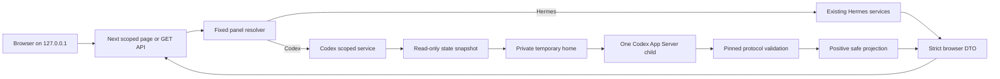
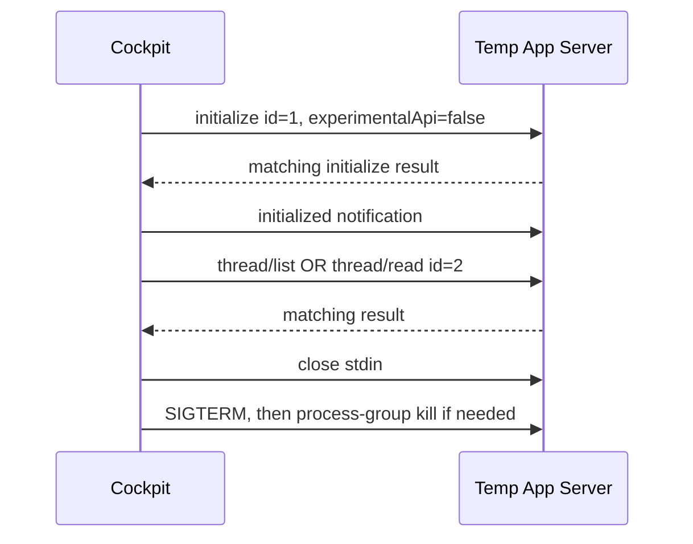

# Cockpit v0.2 Codex Integration Technical Design

## Status

Confirmed by the user on 2026-09-15 after the product requirements were confirmed.
The task plan was also confirmed on 2026-09-15. Tasks 2–9 have completed the
fixed structural panel/browser-contract foundation, bounded production Codex
reader boundary, safe Tasks/main-transcript and Process projections, scoped
API/source orchestration, URL-authoritative Agent navigation, and Codex Tasks UI.
Task 8 passed its non-browser gate and the user-run 26/26 targeted synthetic
browser checks on 2026-09-16. Task 9's Overview, System, and optional Files UI
is implemented and passes 63 files / 617 non-browser tests plus typecheck,
zero-warning lint, and the production build. Its user-run isolated browser gate
passed 29/29 checks on 2026-09-17: `legacy-ready` 12/12, `dual-ready` 16/16,
and `dual-codex-unavailable` 1/1.
The user approved Task 1's actual-empty-placeholder correction and the
narrower OS outbound-deny verification on 2026-09-15. Basic synthetic reads and
412 local tests/build pass. The final result-based parent-loss checker also
passes with PID-and-process-group exit, unchanged source fingerprints and exact
owned cleanup, so Task 1 is GO; see the [synthetic spike findings](spike-report.md).

## 1. Design premise

### User outcome

A returning local user opens Cockpit directly in the Agent panel they used last,
can deliberately switch between Hermes and Codex, and can inspect each Agent's
truthful capabilities without changing either Agent.

For Codex, the valuable new behavior is not merely listing tasks. It is a safe,
bounded view of the observable work process: progress commentary, completed plan,
reasoning summary, selected command and tool evidence, and approved file changes.
Every task also needs an always-visible, bounded Project context label so a user can
recognize the codebase without seeing a machine path or navigating a separate
Project hierarchy.

### Observed problem

Cockpit v0.1 assumes one global Hermes data scope in its root layout, navigation,
services, APIs, identifiers, and browser fetches. Adding Codex without making that
scope explicit would allow stale requests, identifiers, labels, or failures to
cross Agent boundaries.

The supported Codex App Server offers documented read operations, including
`thread/list` and `thread/read`, over a stdio JSONL protocol. However, an isolated
experiment with Codex CLI 0.145.0 showed that App Server initialization in an
otherwise empty home creates its own SQLite databases, coordination files,
installation state, logs, and bundled skill files. It also emitted an unsolicited
notification whose parameters included local installation metadata. Therefore,
pointing App Server at the user's real `CODEX_HOME` would violate Cockpit's strict
source boundary even if Cockpit called only read methods.

### Minimum constraints

The design must therefore keep these invariants:

1. The scoped URL, not mutable global state, identifies the active Agent.
2. Panel configuration is fixed server-side and supports only one Hermes and one
   Codex panel.
3. App Server receives only Cockpit-owned temporary snapshots. Every
   query-visible rollout path in the copied database is replaced with a
   Cockpit-owned sentinel or the one copied rollout before the child starts, so
   the official reader cannot resolve a real rollout through its state view.
4. Each App Server child performs one allowlisted read operation and is then
   terminated.
5. Browser DTOs are newly constructed positive projections; raw protocol objects
   are never passed through.
6. Hermes v0.1 behavior remains available unchanged when Codex is not enabled.

### Non-goals

This design does not introduce a runtime plugin registry, generic adapter SDK,
setup wizard, persistent Cockpit database, background synchronization, task
controller, raw protocol debugger, remote service, authentication, or multi-user
mode.

## 2. Research and ablation decisions

The design uses the documented [Codex App Server protocol][app-server] for its
stable read path and the documented [AGENTS.md guidance model][agents-md] only to
describe current guidance honestly. The exact supported integration target is
Codex CLI `0.145.0`.

| Candidate                                                  | Decision | Reason                                                                                                               |
| ---------------------------------------------------------- | -------- | -------------------------------------------------------------------------------------------------------------------- |
| Direct App Server access to real `CODEX_HOME`              | Reject   | Initialization writes local state even before a task read.                                                           |
| Cockpit-owned temporary state snapshot                     | Keep     | Preserves the official reader while isolating all App Server writes.                                                 |
| Parse Codex rollout JSONL directly in Cockpit              | Reject   | Couples Cockpit to a larger private persistence format and bypasses the official protocol.                           |
| Copy the entire Codex home                                 | Reject   | Unbounded and would copy auth, config, plugins, memories, and unrelated private data.                                |
| One long-lived App Server daemon                           | Reject   | Adds shared state, notification handling, cleanup, and cross-request contamination without measured need.            |
| One process per read operation                             | Keep     | Simple ownership, bounded lifetime, and deterministic cleanup.                                                       |
| Experimental turn or item pagination                       | Reject   | v0.2 uses only stable `thread/read`; an oversized task fails safely.                                                 |
| Generic `RuntimeAdapter` interface                         | Reject   | Only two known runtimes exist and their DTOs differ materially. An explicit service `switch` is smaller and clearer. |
| Browser Agent picker on every launch                       | Reject   | It adds an unnecessary click; the last valid panel is restored instead.                                              |
| Dropdown Agent selector                                    | Reject   | There are at most two panels, so two visible links are simpler and more accessible.                                  |
| Separate Process page or debugger                          | Reject   | A folded timeline inside the selected task answers the current user need.                                            |
| Raw commands, output, patches, or tool payloads            | Reject   | Their shape and sensitivity are unbounded; audited positive projections retain useful evidence.                      |
| Temporary output and patch detail endpoint                 | Reject   | Safe excerpts fit inside the bounded task DTO, avoiding another selector and reader call.                            |
| Treat recorded `cwd` as an official Codex Project identity | Reject   | The stable read protocol exposes working-directory metadata, not a stable Project ID or hierarchy.                   |
| Bounded Project display label                              | Keep     | The final safe folder segment gives immediate task context without exposing the path or authorizing Files access.    |
| Project page, grouping, filter, or registry                | Reject   | A mandatory row label solves the present recognition problem; navigation and indexing add no current value.          |

The temporary snapshot is not a persistent second application database. It is an
ephemeral, per-operation copy under Cockpit's private temporary directory and is
removed after the owned child exits.

## 3. System architecture



The panel resolver performs no live source reads. It returns a private, frozen
descriptor containing only trusted server configuration. A separate public panel
summary omits every root, executable, persistence filename, and source mapping.

There is deliberately no process-wide `currentAgent`. Every page and API resolves
its panel from the scoped route, validates the requested capability, and only then
calls that runtime's service.

### Proposed module boundaries

```text
src/contracts/
  agents.ts                    safe panel and scoped-envelope schemas
  codex.ts                     Codex-only browser DTO schemas

src/server/panels/
  registry.ts                  fixed configuration and capability matrix
  routing.ts                   legacy/scoped mode and default resolution
  opaque-token.ts              panel-bound task and cursor tokens

src/server/codex/
  context.ts                   lazy trusted-root and executable/version probe
  limits.ts                    one frozen limits object
  state-snapshot.ts            parent controller for the bounded snapshot worker
  snapshot-worker.mjs          fixed internal SQLite backup and temp-DB rewrite
  protocol.ts                  pinned wire schemas and JSONL state machine
  app-server-reader.ts         one child and one read request
  process-projection.ts        raw items to safe timeline rows
  guidance.ts                  current bounded guidance sources

src/server/services/
  agents.ts                    explicit runtime switch for scoped surfaces
  codex-overview.ts
  codex-conversations.ts
  codex-system.ts
```

Existing Hermes adapters and DTOs remain Hermes-specific. Existing Files readers
are parameterized by the resolved panel root rather than duplicated.

## 4. Panel configuration and operating modes

### Fixed panel model

v0.2 has two built-in descriptors. IDs and display names are not user-defined:

```ts
type AgentPanelId = "hermes" | "codex";
type AgentRuntime = "hermes" | "codex";
type AgentSurface = "overview" | "system" | "conversations" | "files" | "jobs";

type PublicAgentPanel = {
  id: AgentPanelId;
  name: "Hermes" | "Codex";
  runtime: AgentRuntime;
  surfaces: AgentSurface[];
};
```

Fixing these values structurally eliminates duplicate IDs, unsafe labels, and an
unnecessary general configuration format. Supporting multiple instances of one
runtime is deferred until a real user need requires it.

### Environment configuration

Existing Hermes variables retain their current meaning:

- `COCKPIT_WORKSPACE_ROOT`
- exactly one of `COCKPIT_SOURCE_PRESET` or `COCKPIT_SOURCE_MANIFEST`
- optional `COCKPIT_HERMES_HOME`

Codex adds only:

| Variable                        | Meaning                                                                                                                |
| ------------------------------- | ---------------------------------------------------------------------------------------------------------------------- |
| `COCKPIT_CODEX_HOME`            | Required, explicit opt-in to the Codex panel and its trusted source home.                                              |
| `COCKPIT_CODEX_WORKSPACE_ROOT`  | Optional approved Files root and the only root that authorizes file, command-path, patch, or tool-path details.        |
| `COCKPIT_CODEX_CUSTOM_GUIDANCE` | Optional workspace-root-relative current guidance file, for example `SOUL.md`; invalid without a Codex workspace root. |

One shared variable, `COCKPIT_DEFAULT_PANEL`, may be `hermes` or `codex` and must
name a configured panel after the panel set is constructed. It does not enable
Codex and does not depend on `COCKPIT_CODEX_HOME` when it names Hermes.

No browser endpoint can set these values. The Codex executable is resolved from
the server's startup `PATH`; the browser cannot supply an executable path.
Resolution, canonicalization, and version probing are delayed until a validated
Codex-scoped request actually invokes the Codex reader. The exact version is
rechecked inside every owned read operation; an inactive Codex panel is never
probed.

### Mode resolution

The registry parses only bounded strings, required absolute-vs-relative shape,
NUL/control exclusions, and structural relationships before a reader is called:

1. If `COCKPIT_CODEX_HOME` is absent and no other Codex-specific variable is set,
   Cockpit runs in `legacySingleHermes` mode. Existing unscoped pages, APIs, and
   naked Hermes DTOs keep their v0.1 behavior, including bounded unavailable
   states when Hermes itself is incomplete.
2. If `COCKPIT_CODEX_WORKSPACE_ROOT` or `COCKPIT_CODEX_CUSTOM_GUIDANCE` is set
   without `COCKPIT_CODEX_HOME`, configuration is invalid. The shared default
   variable is validated separately against the final panel set.
3. With Codex enabled, Hermes is also configured only when its workspace and
   exactly one source selector are present. No Hermes-specific panel variables
   means Codex-only mode. A partial or conflicting Hermes configuration fails
   structurally instead of being guessed.
4. `COCKPIT_CODEX_CUSTOM_GUIDANCE` must pass the non-filesystem part of the
   existing relative-path policy and requires a configured Codex workspace root.
5. Private descriptors retain the configured strings. Canonical roots, executable
   version, and source readiness are resolved lazily only inside the selected
   panel's reader; an inactive panel is never probed. No root appears in
   `PublicAgentPanel`.

The capability matrix is static:

| Surface                                                 | Hermes | Codex without workspace | Codex with workspace |
| ------------------------------------------------------- | -----: | ----------------------: | -------------------: |
| Overview                                                |    Yes |                     Yes |                  Yes |
| System                                                  |    Yes |                     Yes |                  Yes |
| History (`Conversations` for Hermes, `Tasks` for Codex) |    Yes |                     Yes |                  Yes |
| Files                                                   |    Yes |                      No |                  Yes |
| Jobs                                                    |    Yes |                      No |                   No |

`conversations` remains the stable internal surface ID and scoped route segment.
The shell, page H1, loading, empty, and failure copy use the runtime-specific
display label. A Project label is task metadata, not another surface.

## 5. Routing, preference, and request isolation

### Canonical scoped routes

```text
/agents/[panelId]
/agents/[panelId]/system
/agents/[panelId]/conversations
/agents/[panelId]/files
/agents/[panelId]/jobs
```

The matching scoped APIs are explicit route handlers:

```text
/api/agents/[panelId]/overview
/api/agents/[panelId]/system
/api/agents/[panelId]/system/context
/api/agents/[panelId]/conversations
/api/agents/[panelId]/conversations/[id]
/api/agents/[panelId]/files
/api/agents/[panelId]/files/preview
/api/agents/[panelId]/jobs
```

There is no catch-all runtime proxy. Each handler has a fixed method, query
schema, capability, service call, and response schema.

`/api/agents/[panelId]/system/context` is the existing Hermes skill/document
detail operation, not a universal System subresource. A Codex request returns
`404 unsupported_capability` before parsing a context ID or invoking any reader;
Codex System guidance is already bounded inside its strict snapshot.

### Next application structure

The root layout retains neutral `Cockpit` document metadata, fonts, body styling,
the skip link, and the existing awaited `connection()` call that keeps local
source work out of Next's prerender/build phase. It must no longer load a Hermes
profile. Static panel identity is passed to a refactored shell without touching
Agent sources. The legacy nested layout, rather than the document root, owns the
v0.1 Hermes profile stamp.

```text
src/app/layout.tsx                       document shell only
src/app/(legacy)/layout.tsx              v0.1 Hermes shell and profile stamp
src/app/(legacy)/...                    current unscoped v0.1 URLs
src/app/agents/[panelId]/layout.tsx      static validated panel shell
src/app/agents/[panelId]/...             capability-validated pages
src/app/api/...                          legacy handlers with mode guard
src/app/api/agents/[panelId]/...         scoped handlers
```

Dynamic `params` and `cookies()` are awaited according to Next.js 16 conventions.
A scoped layout may validate the fixed panel ID for shell rendering, but each page
validates its capability before rendering the last-panel commit component. A page
that names an unsupported capability never invokes a runtime reader and renders a
bounded in-shell `Unsupported for <Agent>` state. The matching API returns the
documented `404 unsupported_capability` diagnostic.

A production-build regression test runs without any local Hermes or Codex source
configuration and fails if a reader is invoked during prerender. Scoped metadata
uses the validated fixed panel name when useful; no page inherits the current
hardcoded `Cockpit / Hermes` title while Codex is active.

### Legacy behavior

- In `legacySingleHermes`, `/`, `/system`, `/conversations`, `/files`, `/jobs`, and
  current unscoped APIs behave as they do in v0.1.
- In scoped mode, an unscoped page redirects to the chosen panel's equivalent
  surface when supported, otherwise its Overview.
- In scoped mode, every unscoped data API returns `400 panel_required`; it never
  uses a cookie to infer data authority.

### Last-Agent preference

The URL is authoritative for the current tab. A cookie only selects the target of
a later unscoped page visit:

```text
name:     cockpit_last_panel
value:    hermes | codex
path:     /
sameSite: Strict
maxAge:   31536000
domain:   omitted
secure:   omitted because the supported origin is HTTP loopback
httpOnly: false because a tiny client component writes after navigation commits
```

The server reads this cookie only while redirecting an unscoped page and validates
the value against the configured panel registry. APIs ignore it. A stale value is
discarded.

Default resolution is deterministic:

1. a valid remembered panel;
2. a configured `COCKPIT_DEFAULT_PANEL`;
3. Hermes when configured;
4. the only configured panel.

`LastPanelCommit` writes the fixed opaque panel ID only after a scoped page has
validated both the panel and surface. It is rendered by each valid surface page,
not by the shared `[panelId]` layout. Therefore a bad bookmark, unsupported page,
prefetch, API request, or failed panel parse cannot replace the preference.

The cookie is shared by tabs in one browser profile. The most recent completed
scoped navigation wins for future root visits, while existing tabs remain on the
Agent encoded in their own URLs. No `storage` event, BroadcastChannel, or global
React Agent state is added.

### Panel-bound opaque identifiers

Scoped task IDs and cursors use AES-256-GCM with a random process-local 32-byte
key. The associated data includes:

```text
cockpit-v0.2 | token kind | panel ID | runtime | adapter version
```

The encrypted payload contains only the raw runtime ID or cursor, token version,
and the minimum ordering metadata. Tokens are length-bounded and decoded before a
database, file, or child process is opened. A cross-panel, forged, wrong-kind, or
old-adapter token fails authentication. A server restart intentionally invalidates
tokens; the UI returns to a fresh list instead of storing a key or identifier.

Legacy unscoped Hermes token behavior remains unchanged. Scoped Hermes routes use
the new panel-bound codec so a scoped token can never be replayed under Codex.

## 6. HTTP contracts

### Scoped response envelope

Every successful scoped API returns a strict envelope:

```ts
type ScopedSuccess<T> = {
  panelId: "hermes" | "codex";
  runtime: "hermes" | "codex";
  data: T;
};
```

The route parses the runtime-specific `data` schema before constructing the
envelope. The browser parses the complete envelope and confirms that `panelId`
matches the scoped page prop before committing state. In-flight requests are
aborted on selection, page, or panel change. An old response can therefore never
populate a newly scoped page.

Failures use a strict safe diagnostic and never echo an untrusted requested panel
ID. A known panel ID may be included because it came from the fixed registry.

New safe codes are limited to:

| Code                          | HTTP | Meaning                                                 |
| ----------------------------- | ---: | ------------------------------------------------------- |
| `panel_required`              |  400 | An unscoped API was called while scoped mode is active. |
| `invalid_panel`               |  404 | The route panel is not in the fixed registry.           |
| `unsupported_capability`      |  404 | The known panel does not provide this surface.          |
| `unsupported_runtime_version` |  503 | The installed Codex CLI is not exactly supported.       |
| `protocol_violation`          |  503 | The owned reader produced an invalid exchange.          |

Existing `invalid_path`, `source_busy`, `source_too_large`, `source_malformed`,
`missing_source`, and `source_unavailable` codes remain applicable. Logs for 5xx
failures contain only fixed `panelId`, fixed `sourceId`, and the safe code.

All routes retain `private, no-store`, strict allowed query keys, no permissive
CORS, current Host/Origin/Fetch-Metadata protection, CSP, `nosniff`, and GET-only
application methods.

## 7. Codex browser DTOs

Codex contracts are separate from Hermes contracts. The browser never receives a
mega-object whose fields are optional depending on runtime.

### System snapshot

Codex System does not reuse the Hermes `SourceStamp`, whose allowlisted local
path is useful for Hermes but would disclose the Codex home. It has its own strict
path-free contract:

```ts
type CodexSystemSnapshot = {
  runtime:
    | { label: "Codex CLI"; state: "ready"; version: "0.145.0" }
    | { label: "Codex CLI"; state: "unavailable" | "error"; message: string };
  sources: CodexGuidanceSource[];
  observedAt: string;
};

type CodexGuidanceSource =
  | {
      key: "global-guidance" | "workspace-guidance" | "custom-guidance";
      label: "Global guidance" | "Workspace guidance" | "Custom guidance";
      origin: "Codex home" | "Approved workspace" | "Configured workspace file";
      state: "ready";
      content: string;
      truncated: boolean;
    }
  | {
      key: "global-guidance" | "workspace-guidance" | "custom-guidance";
      label: "Global guidance" | "Workspace guidance" | "Custom guidance";
      state: "missing" | "unavailable" | "error";
      message: string;
    };
```

The projection never contains the Codex home, an absolute path, a source
filename supplied by the private configuration, or a reusable persistence ID.

### Task index

```ts
type CodexTaskSummary = {
  id: string; // panel-bound opaque token
  title: string | null;
  preview: string | null;
  source: "CLI" | "VS Code" | "App Server";
  lastActivity: string | null;
  status: "idle" | "active" | "error" | "unknown";
  projectLabel: string | null; // safe cwd basename; null renders UNKNOWN
};

type CodexTaskPage = {
  items: CodexTaskSummary[];
  nextCursor: string | null;
  observedAt: string;
  indexScope: "Codex state database";
  inventoryNote: "State-database index; some local tasks may be absent.";
};
```

The initial Tasks request and every `Show more` page use the same fixed
page size of five. The list request is:

```ts
{
  archived: false,
  sourceKinds: ["cli", "vscode", "appServer"],
  useStateDbOnly: true,
  sortKey: "recency_at",
  sortDirection: "desc",
  limit: 5,
  cursor: internallyDecodedCursor,
}
```

The projection independently drops an item unless its returned `source` is one of
the three exact string values. It also drops ephemeral, parent, sub-Agent, custom,
`exec`, review, and unknown sources. Raw thread ID, session ID, persistence path,
working directory, Git metadata, Agent role, and provider data are omitted.

`useStateDbOnly` intentionally avoids a JSONL repair scan. The UI labels the list
as the state-database index, not a guaranteed complete inventory.

Task metadata is projected without guessing:

- `title` comes only from a non-empty protocol `thread.name`; otherwise it is
  `null` and the UI says `Untitled task` as an explicit absence label;
- `preview` comes only from non-empty `thread.preview`; otherwise that row omits
  preview text;
- `lastActivity` is a validated time from `recencyAt`, falling back only to the
  authoritative `updatedAt`; an invalid or absent value is `null` and displays
  `Unknown`;
- `source` accepts only the three allowlisted scalar protocol sources and maps
  them to fixed labels;
- `status` positively maps documented idle, active, and system-error variants;
  every other shape is `unknown`;
- `projectLabel` is constructed only from a bounded scalar absolute `thread.cwd`
  by lexically removing trailing separators and selecting its final non-empty
  folder segment; the projector does not resolve or open the path, inspect parent
  directories, discover a repository, or read Git metadata;
- the selected segment must be one line, pass the existing control-character,
  bidirectional-control, credential-shaped filename, and browser-text exclusions,
  and fit the Project label limit; a filesystem root, operator-home root,
  Codex-home root, empty segment, `.`, `..`, or rejected value yields `null`
  rather than a truncated or guessed label;
- the UI always renders `PROJECT / <projectLabel>` or `PROJECT / UNKNOWN`.
  This is a best-effort context hint, not an official Codex Project identity,
  grouping key, route parameter, Files root, or permission. Raw `cwd` never
  enters the DTO.

### Task detail

```ts
type CodexTaskDetail = {
  summary: CodexTaskSummary;
  turns: SafeCodexTurn[];
  observedAt: string;
  omitted: OmittedContent[];
};

type SafeCodexTurn = {
  key: string; // synthetic ordinal, never raw turn ID
  status: "completed" | "interrupted" | "failed" | "in-progress";
  messages: SafeCodexMessage[];
  process: SafeProcessTimeline | null;
  omitted: OmittedContent[];
};

type SafeCodexMessage = {
  key: string; // synthetic ordinal
  role: "user" | "assistant" | "status";
  content: string;
};

type OmittedContent = {
  reason: "limit" | "policy" | "unsupported";
  label: "Content omitted by limit" | "Details hidden by policy" | "Unsupported activity omitted";
  count?: number;
};
```

Only text user inputs enter the transcript. A non-text input becomes a fixed
placeholder such as `Image input omitted`; its URL, path, asset ID, mention, or
payload is never copied. Only `agentMessage` items whose phase is exactly
`final_answer` become assistant transcript messages. An absent phase is omitted.

For `completed`, `interrupted`, and `failed` turns, the transcript ends with the
final answer when present and then Process. If no final answer exists, a fixed safe
terminal status precedes Process. An `inProgress` turn shows `Still in progress;
refresh later` and does not expose that turn's unfinished Process as completed
history. Previously terminal turns in the same task remain visible.

### Process timeline

```ts
type SafeProcessTimeline = {
  count: number; // top-level visible rows only
  rows: SafeProcessRow[];
  omitted: OmittedContent[];
};

type SafeProcessRow =
  | { type: "progress"; key: string; text: string }
  | { type: "reasoning_summary"; key: string; text: string }
  | { type: "plan"; key: string; text: string }
  | SafeCommandRow
  | SafeToolRow
  | SafeChangesRow
  | {
      type: "hidden";
      key: string;
      label: "Details hidden" | "Unsupported activity";
      itemType: "Command" | "Tool" | "Changes" | "Activity";
      status?: "completed" | "failed" | "declined";
      count: number;
    };

type SafeCommandRow = {
  type: "command";
  key: string;
  label: "Command";
  preview?: string;
  status: "completed" | "failed" | "declined";
  durationMs?: number;
  exitCode?: number;
  output?: { text: string; truncated: boolean };
};

type SafeToolRow = {
  type: "tool";
  key: string;
  label: "Viewed image" | "Web search" | "Tool";
  status?: "completed" | "failed" | "declined";
  durationMs?: number;
  fields: Array<{ label: "File"; value: string }>;
};

type SafeChangesRow = {
  type: "changes";
  key: string;
  status: "completed" | "failed" | "declined";
  files: Array<{ path: string; change: "add" | "modify" | "delete" }>;
  patch?: { text: string; truncated: boolean };
};
```

The `key` fields are projection ordinals, not App Server item IDs. `count` equals
`rows.length`; opening output or patch details never changes it.

Authoritative persisted item order is retained. Consecutive unsafe or unsupported
items are aggregated only while their `(label, itemType, status)` tuple is exactly
the same; a different generic type or terminal status starts a new row. The
aggregate stays at its first item's position and `count` records only that
identical group. This bounds noise without erasing or moving evidence. When the
raw item has an authoritative terminal status, the hidden row must retain its
allowlisted status; only item types without such a protocol field omit it.

#### Positive item policies

| Raw item                                                                                                 | Visible projection                                                                                                          |
| -------------------------------------------------------------------------------------------------------- | --------------------------------------------------------------------------------------------------------------------------- |
| `agentMessage` with `commentary`                                                                         | `Progress` text after the common text pipeline.                                                                             |
| `reasoning`                                                                                              | Only the `summary` string array, joined in order and labeled `Reasoning summary`. `content` is never read into a DTO field. |
| `plan`                                                                                                   | Completed authoritative `text`; streaming deltas are not consumed.                                                          |
| terminal `commandExecution`                                                                              | Fixed `Command` label, status, bounded duration, and exit code; preview/output only under policies below.                   |
| `fileChange`                                                                                             | Safe relative paths and status; patch only when every path and all content pass policy.                                     |
| `imageView`                                                                                              | `Viewed image` and one `File` field only when the canonical file is inside the approved workspace.                          |
| `webSearch`                                                                                              | Generic `Web search` row; query and results remain hidden in v0.2.                                                          |
| MCP, dynamic tools, collaboration, image generation, hooks, review, compaction, sleep, and unknown items | Generic or aggregated hidden row with no raw names, arguments, results, IDs, or resources.                                  |

The first command preview policies use documented structured `commandActions`,
not arbitrary shell parsing:

- exactly one `read` action becomes `Read <approved-relative-path>`;
- exactly one `listFiles` action becomes `List files in
<approved-relative-path>` or `List workspace files`;
- exactly one `search` action becomes `Search in <approved-relative-path>`; the
  arbitrary search query remains hidden;
- multiple, `unknown`, out-of-root, missing-root, or malformed actions retain only
  `Command` and status.

The first independent output policy applies only to a single validated
`listFiles` action. Its aggregated output must fit the output cap and every
non-empty line must be a plain relative path that passes the existing exclusion
and canonical workspace-containment policy. If one line fails, the entire output
is hidden. The visible preview does not depend on output being safe.

For `fileChange`, relative paths are resolved against the raw thread working
directory only inside the server and absolute paths are canonicalized directly.
Every add, modify, or delete path must land in the approved workspace. Existing
paths are opened or pinned with the current no-follow policy. A new or deleted
path must have a canonical nearest existing ancestor inside the same root. Move
and unknown change kinds are not reconstructed in v0.2 and degrade to a hidden
change summary. If the path proof is not possible, Cockpit shows only a change
count and hidden-details note.

Patch text is rendered only as inert `<pre><code>` text after all structured paths
pass. It is never interpreted as Markdown. Add/delete payloads are treated as file
content; update payloads must parse as complete unified hunks, so path-bearing
headers or trailing metadata cannot be mistaken for body text. The patch pipeline
removes terminal control sequences, redacts credentials and machine paths, bounds
lines and bytes, and replaces raw diff headers with Cockpit-constructed
relative-path headers.

The initial tool-field policy is deliberately narrow: an `imageView` item may
show `File: relative/path.png` after canonical containment. This proves useful
tool-parameter visibility without introducing a per-tool UI or a generic
argument serializer. All other fields remain absent.

### Common text pipeline

Every protocol-derived visible string passes, in order:

1. type and protocol-version validation;
2. CRLF normalization;
3. fatal UTF-8 decoding and ANSI, OSC, C0, and C1 control removal, preserving
   only newline and tab where the field permits them;
4. existing credential and machine-path redaction;
5. per-field Unicode and UTF-8 byte limits;
6. strict final DTO validation.

No raw object spread is allowed from protocol data into a DTO.

### Projection limits

Limits are centralized and frozen. Initial v0.2 values are intentionally
conservative and may be raised only after an observed legitimate rejection:

| Projection                              |                                                         Limit |
| --------------------------------------- | ------------------------------------------------------------: |
| One task-list page                      |                                                       5 tasks |
| Accumulated loaded task index           |                                                      25 tasks |
| Project label                           |                  80 Unicode scalar values and 256 UTF-8 bytes |
| Retained task turns                     |                 100 newest turns, kept in chronological order |
| Main transcript messages                |                                                           250 |
| One main message                        |                 20,000 Unicode scalar values and 64 KiB UTF-8 |
| Main transcript text                    |                                                 256 KiB UTF-8 |
| Process-source items inspected per turn | 200 newest eligible items; transcript-only items do not count |
| Reasoning-summary parts                 |                                              100 newest parts |
| Process rows                            |                                     40 per turn; 300 per task |
| One Process text field                  |                  4,000 Unicode scalar values and 16 KiB UTF-8 |
| Process text total                      |                                                  64 KiB UTF-8 |
| Tool safe fields                        |                                  3; each value 240 characters |
| File paths in one Changes row           |                                                            50 |
| Expanded command output                 |                                           8 KiB and 120 lines |
| Expanded patch                          |                                          24 KiB and 300 lines |
| Serialized task DTO                     |                                                       512 KiB |

Main transcript and Process budgets are independent. Main transcript content is
projected first into its reserved budget. Process truncation drops patch/output
details before top-level rows and can never suppress an otherwise safe main
message. Every truncation produces a structured omitted-content note.

## 8. Codex source surfaces

### Overview

Codex Overview uses one strict Codex-only DTO with four independently rendered
sections:

```ts
type CodexOverviewFailure = {
  state: "unavailable" | "error";
  observedAt: string;
  message: string; // constructed from the safe diagnostic table
};

type CodexOverviewSnapshot = {
  panelName: "Codex";
  observedAt: string;
  runtime:
    | { state: "ready"; observedAt: string; label: "Codex CLI"; version: "0.145.0" }
    | CodexOverviewFailure;
  tasks:
    | { state: "ready"; observedAt: string; items: CodexTaskSummary[]; hasMore: boolean }
    | CodexOverviewFailure;
  guidance:
    | {
        state: "ready";
        observedAt: string;
        items: Array<{
          label: "Global guidance" | "Workspace guidance" | "Custom guidance";
          state: "ready" | "missing" | "unavailable" | "error";
        }>;
      }
    | CodexOverviewFailure;
  workspace:
    | { state: "unsupported"; observedAt: string; message: "Files not configured" }
    | {
        state: "ready";
        observedAt: string;
        loadedCount: number;
        truncated: boolean;
        items: Array<{ name: string; kind: string; size: string; modifiedAt: string }>;
      }
    | CodexOverviewFailure;
};
```

Each discriminated branch is a strict schema; unknown keys are stripped during
wire decoding and rejected at the browser contract. The four sections mean:

1. runtime: fixed `Codex`, exact compatible CLI version or a safe unavailable
   state, and observation time;
2. recent tasks: at most five projected task summaries, each with
   `PROJECT / <label>` or `PROJECT / UNKNOWN`, and `hasMore`;
3. current guidance: only presence/state summaries for the sources below;
4. workspace: the existing bounded overview projection only when a Codex
   workspace root is explicitly configured.

No Jobs card or zero-valued Jobs placeholder is rendered. Each section catches
and reports its own safe failure.

Overview performs exactly one Codex protocol operation: the five-item task-list
read. Its isolated version probe supplies the runtime section and is not repeated
by a second reader. If the probe succeeds but backup or `thread/list` fails, the
runtime remains verified while only tasks fails; if the probe fails, both runtime
and tasks receive bounded failure states. Guidance and the optional workspace use
their existing direct bounded file readers and may settle independently alongside
that one operation. They never acquire the Codex App Server concurrency slot, so
Overview cannot make itself `source_busy` by starting two Codex children.
Its Tasks, System, and Files links set `prefetch={false}` so those additional
local readers start only after explicit navigation.

### System

Codex System is labeled `Current observable guidance`, not historical system
context. It contains:

- a bounded runtime source with exact supported CLI version and no home path;
- at most one non-empty global source selected in this order from the fixed
  Codex home: `AGENTS.override.md`, then `AGENTS.md`;
- at most one non-empty approved-workspace source using the same precedence;
- one optional `Custom guidance` file only when its configured relative path is
  canonical inside the approved Codex workspace.

An existing but unreadable or oversized higher-precedence file produces a scoped
failure rather than silently substituting a lower-precedence file. An empty
override is treated as absent and permits the base file. Duplicate canonical files
are shown once.

Guidance uses the current bounded, no-follow text reader and inert Markdown
component. The UI explicitly states that Codex normally discovers guidance along
a root-to-working-directory chain, while this page intentionally reports only the
two approved roots and cannot prove what a past task used.

No config layers, accounts, model settings, auth, rate limits, MCP, plugins,
skills, hooks, system prompts, or tool definitions are read.

### Tasks (internal `conversations` capability)

`thread/list` supplies the index. Selecting a task calls `thread/read` with only:

```ts
{ threadId: internallyDecodedRawId, includeTurns: true }
```

It does not resume or subscribe to the task. The complete newline-delimited
`thread/read` response must pass the pinned stable response schema before any
turn is projected. If the protocol line or bounded decoded task is too large,
the whole detail read returns `source_too_large`; Cockpit does not infer
completeness from experimental turn-pagination metadata or replay streaming
notifications and deltas.

The initial Tasks render shows the task index and a stable `Select a
task` detail placeholder. It does not eagerly read the first task. A detail
snapshot and App Server child are created only after the user selects a row.

### Files

The existing Files browser and strict DTOs are reused through a scoped API base.
The reader receives the active panel's canonical root as an explicit argument.
Codex task `cwd` never creates Files permission. When no Codex workspace root is
configured, Files is absent from navigation and the direct page/API fails as an
unsupported capability before a path is parsed.

## 9. Codex state snapshot

### Trusted source contract

The first adapter supports exactly Codex CLI `0.145.0` and its state database
filename `state_5.sqlite`. Two private persistence fields are accepted as a
version-specific seam solely to isolate the official reader:

```text
threads.id
threads.rollout_path
```

The adapter validates that table and both columns in the copied database before
use. It does not infer alternate tables, scan for similarly named databases,
migrate data, or fall back to rollout discovery. A version or schema mismatch
makes only the Codex source unavailable.

### List snapshot

1. Create and validate the private per-operation temporary directory before any
   executable probe or source read.
2. Resolve the Codex executable lazily for this selected panel. Run the exact
   version probe in its own process group with the same credential-free temporary
   `HOME`, `CODEX_HOME`, `CODEX_SQLITE_HOME`, working directory, and `TMPDIR` used
   for App Server. Bound it to five seconds, 4 KiB total output, and the common
   group-termination and cleanup path.
3. Canonicalize `<codexHome>/state_5.sqlite` inside the configured trusted root;
   require a regular file owned by the current effective UID and reject symlinks.
   Preflight exact companion `-wal` and `-shm` paths with `lstat`: an existing
   sidecar must also be a non-symlink regular file owned by that UID. Main DB plus
   WAL is limited to 512 MiB; SHM is limited separately to 64 MiB.
4. Spawn one fixed Cockpit snapshot helper in an owned process group. The parent
   uses the canonical `process.execPath`, a fixed canonical helper script, and
   `shell: false`. Its allowlisted environment contains only the temp `HOME` and
   `TMPDIR` plus minimum locale and fixed system-path values; it does not inherit
   `COCKPIT_*`, credential, proxy, `NODE_OPTIONS`, `NODE_PATH`, `DYLD_*`, or
   `LD_*` variables. The parent sends only the internally resolved
   source/destination, operation kind, and optional authenticated raw task ID over
   a private pipe; none of those values enters argv, logs, browser output, or a
   shell. The helper's response is a fixed success/failure code capped at 4 KiB;
   raw stderr follows its separate cap and is never recorded or surfaced.
5. Inside that helper, open the source with `SQLITE_OPEN_READONLY`,
   `fileMustExist`, and `query_only=ON` before application reads, then use
   SQLite's [online backup API][sqlite-backup] to produce a consistent private
   database copy.
6. The parent enforces a hard five-second helper lifetime and kills only its
   owned process group on deadline, cancellation, output overflow, or RSS
   failure. The helper may also use backup progress for cooperative early abort,
   but that callback is not claimed as the hard deadline because one synchronous
   native transfer step can block JavaScript.
7. In a writable transaction against only the copied database, validate the
   private `threads(id, rollout_path)` seam and replace every non-null
   query-visible `rollout_path` with one actually existing empty mode-0600 regular
   placeholder JSONL inside the canonical owned operation directory. Create and
   validate this file before the transaction: the pinned state-only list still
   checks path existence, and a nonexistent sentinel drops all task rows.
   Preserve nulls and verify the affected-row count
   against an immediately preceding count of non-null copied rows, then close the
   copy. This prevents `thread/list` from resolving a real rollout even though the
   temporary SQLite file may still contain inaccessible historical bytes from the
   original backup.
8. Verify that the copied database is regular, contained, and no larger than
   512 MiB. Start App Server against only the temporary environment and call
   `thread/list` with state-database-only behavior.

SQLite's backup mechanism is retained because it produces a consistent snapshot
while a source may have an active writer. A normal file copy of a live main DB and
WAL is not an acceptable replacement.

### Detail snapshot

Task detail uses the same preflight, isolated version probe, worker, and online
backup controls, with this operation-specific sequence:

1. Decode and authenticate the panel-bound task token before opening the source.
2. Pass that internal raw ID to the snapshot helper over its private pipe. After
   online backup, the helper queries the copied database for exactly one matching
   `threads(id, rollout_path)` row before paths are scrubbed.
3. Canonicalize the source rollout. It must be a regular `.jsonl` file under the
   canonical `<codexHome>/sessions` or `<codexHome>/archived_sessions` directory,
   must not be a symlink, and must not exceed 32 MiB.
4. Open it with `O_RDONLY | O_NOFOLLOW`, capture `dev`, `ino`, `size`, and
   high-resolution modification time, and copy exactly that initial size into a
   mode-`0600` temp file. A second `fstat` must show the same identity, size, and
   modification time. A changed source restarts the copy once with a newly pinned
   descriptor; a second change, shrink, replacement, timeout, or short read
   returns `source_busy`. This makes the copied byte prefix stable without
   following an actively appended file indefinitely.
5. In one transaction against only the copied database, first replace every
   `rollout_path` with the temp sentinel and then execute:

   ```sql
   UPDATE threads
   SET rollout_path = ?
   WHERE id = ?
   ```

   The target value is the copied rollout path. The target change count must be
   exactly one. This write affects only Cockpit's disposable copy.

6. Close the copied database, start a fresh App Server child, and call
   `thread/read` against the copied row and copied rollout.

The App Server state view contains no query-visible real rollout path. The real
database path, real rollout path, raw thread ID, copied paths, and helper messages
are not given to the browser or logs.

## 10. App Server process protocol

### Sterile child environment

The exact canonical executable is spawned with `shell: false`, a temporary working
directory, detached process-group ownership on supported Unix systems, and fixed
arguments:

```text
codex app-server --listen stdio:// --strict-config
  --disable plugins
  --disable remote_plugin
  --disable apps
  -c analytics.enabled=false
  -c check_for_update_on_startup=false
```

The child environment includes only the minimum system locale/path values plus:

```text
HOME=<owned temp home>
CODEX_HOME=<owned temp home>
CODEX_SQLITE_HOME=<owned temp state directory>
TMPDIR=<owned temp tmp directory>
TERM=dumb
```

OpenAI, GitHub, cloud-provider, proxy, plugin, application, and other credential
variables are not inherited. No custom proxy mechanism is added; the approved
OS denial is a synthetic acceptance policy, not a production network sandbox.

The environment removes source paths from environment variables and normal
Codex discovery inputs; the copied database's query-visible rollout paths are
scrubbed separately. It is not an OS capability boundary: a malicious same-UID
binary could still enumerate the user's filesystem or inspect arbitrary readable
temporary bytes. v0.2 therefore trusts the exact pinned Codex executable. Remote,
multi-user, elevated, or untrusted-binary operation requires a new OS sandbox
design.

### State machine



Initialization capabilities are fixed:

```ts
{
  clientInfo: { name: "cockpit", title: "Cockpit", version: "0.2.0" },
  capabilities: {
    experimentalApi: false,
    requestAttestation: false,
    mcpServerOpenaiFormElicitation: false,
    optOutNotificationMethods: ["remoteControl/status/changed"],
  },
}
```

The observed 0.145.0 process emitted `remoteControl/status/changed` during isolated
initialization. Even after opting out, the reader tolerates at most four instances
of this exact no-ID notification, discards its entire `params` object without
inspection, and never logs it. Any other notification is protocol drift and fails
closed.

Protocol rules:

- there is at most one pending numeric request ID;
- a response ID must exactly match `1` or `2` at the appropriate state;
- missing, string, duplicate, old, or unknown IDs fail the session;
- `result` and `error` are mutually exclusive;
- any inbound object containing both a method and an ID is a server request and
  immediately terminates the child without a reply;
- only `initialize`, `initialized`, one `thread/list` or one `thread/read` are ever
  sent;
- a fatal UTF-8 `TextDecoder` reads newline-delimited messages;
- a truncated or over-limit JSON line is never parsed;
- raw stderr, raw errors, notifications, and responses are never logged.

For `thread/read`, a matching JSON-RPC response ID is necessary but not
sufficient. Before projection, `result.thread.id` must exactly equal the raw ID
decoded from the authenticated task token, the copied database must still contain
exactly that row, and the returned thread source must independently be one of
`cli`, `vscode`, or `appServer`. A different ID, an excluded source kind, or a
missing copied row terminates the session as `protocol_violation`; it can never be
substituted into the requested task.

The initialize result must report the temporary `codexHome`, a supported Unix
platform, and a `userAgent` matching the exact audited 0.145.0 format. The separate
bounded `codex --version` probe must agree.

The pinned
[User-Agent constructor](https://github.com/openai/codex/blob/rust-v0.145.0/codex-rs/login/src/auth/default_client.rs#L146-L168)
uses the OS distribution/version and architecture followed by the fixed sterile
terminal and client suffix. Linux distribution names are not assumed to be the
literal `Linux`. Live acceptance in this report is macOS only; Linux is not
claimed as live-tested.

### Process limits

| Resource                          |                                                                Limit |
| --------------------------------- | -------------------------------------------------------------------: |
| Exact supported CLI               |                                                  `codex-cli 0.145.0` |
| Version probe                     |                                              5 seconds; 4 KiB output |
| State DB plus source WAL          |                                                              512 MiB |
| Snapshot helper and SQLite backup |                                       5 seconds hard parent deadline |
| Rollout source                    |                                                               32 MiB |
| Rollout copy                      | Within the same 5-second snapshot-helper budget; one restart maximum |
| Initialize response               |                                                            5 seconds |
| `thread/list` response            |                                                            3 seconds |
| `thread/read` response            |                                                           10 seconds |
| Total child lifetime              |                             10 seconds for list; 15 seconds for read |
| One protocol line                 |                                                               16 MiB |
| Total stdout                      |                                                               17 MiB |
| Total stderr                      |                                               64 KiB, never surfaced |
| Total protocol messages           |                                16, including tolerated notifications |
| Concurrent Codex readers          |                                           1, with no unbounded queue |
| Graceful stdin close              |                                                               250 ms |
| SIGTERM grace                     |                                     500 ms before process-group kill |
| RSS watchdog                      |     384 MiB for the entire owned process group, sampled every 250 ms |

Node does not expose a portable hard memory limit for an external child. The first
Codex integration therefore supports macOS and Linux hosts with a fixed-argv,
shell-free `ps` RSS watchdog. Each sample enumerates the owned process group and
sums the resident memory of its leader and every descendant. Failure to enumerate
the group twice, or observing more than 384 MiB in total, kills that group and
returns a safe unavailable state. The same controller covers the version probe,
snapshot helper, and App Server. This is an operational bound, not a kernel
capability sandbox. If release acceptance requires a hard process-group memory
ceiling, implementation stops and adds a native OS resource boundary rather than
overstating the watchdog.

Windows may continue to use Hermes, but the Codex panel remains unsupported until
equivalent child-group termination and resource monitoring are designed and
tested.

## 11. Temporary ownership and cleanup

The temp parent is the fixed `cockpit-codex-<effective-uid>` directory beneath
canonical Unix `/tmp` (`/private/tmp` on macOS), independent of inherited or
sterile-child `TMPDIR`. Creation, worker validation and stale cleanup retain the
same containment check; there is no browser- or pipe-supplied root override.
It is validated as a real, non-symlink directory owned by the current UID with
mode `0700`. Each
operation uses `mkdtemp`, creates a constant-version owner marker, and restricts
files containing source data to mode `0600`.

Every version probe, snapshot helper, and App Server process has its own recorded
PID, process-group ID, executable identity, and start token in the private owner
marker. Each uses a parent-owned pipe; the snapshot helper aborts on EOF, and the
exact 0.145.0 App Server must be proved to exit when its stdin closes before the
integration proceeds.

On success, protocol failure, output overflow, timeout, abort, or child exit:

1. close stdin;
2. terminate only the owned process group;
3. await exit or apply the kill deadline;
4. close all source and temporary descriptors;
5. recursively delete only the fully resolved owned operation directory.

A startup stale reaper examines a bounded number of direct children only. It may
delete a directory only when it is older than one hour, is not a symlink, is owned
by the current UID, is contained by the canonical temp parent, contains the exact
Cockpit owner marker, and no recorded PID or process group is still live. An
ambiguous liveness or identity result leaves the directory untouched; the reaper
never kills a process. It never follows paths from a marker or scans beyond the
fixed parent.

Temporary snapshots contain personal history while an operation runs and may
survive a hard host crash until a later validated cleanup. A host `SIGKILL` can
also orphan a child briefly; the go/no-go spike simulates that failure and must
prove stdin-EOF exit for the pinned App Server and helper. The reaper never deletes
an operation directory still referenced by a live process. These residuals are
acceptable only under the existing same-user local trust model and are documented
in the security boundary.

## 12. Read-only and privacy properties

### Real Codex sources

Cockpit performs no application write against the real Codex home, main database,
existing non-empty WAL, rollouts, configuration, auth, guidance, plugins, skills,
or workspace.

Preparing the SQLite snapshot extends the already approved narrow coordination
exception to the fixed Codex state database: a `SQLITE_OPEN_READONLY` plus
`query_only` connection may create or restore an empty WAL and may create or
update the disposable SHM wal-index. It may not change the main database, existing
non-empty WAL content, or business records. If these sidecars are harmful to a
user's permissions, backup tooling, or watchers, the Codex panel must fail closed
until a bit-for-bit reader exists.

The sidecar contract is exact:

| Path state             | Before read                                                     | Accepted after read                                                                                |
| ---------------------- | --------------------------------------------------------------- | -------------------------------------------------------------------------------------------------- |
| Main DB                | regular, non-symlink, current UID, within size cap              | same identity, bytes, size, and high-resolution mtime                                              |
| Existing non-empty WAL | regular, non-symlink, current UID, combined DB/WAL cap          | same identity, bytes, size, and high-resolution mtime                                              |
| Missing or empty WAL   | missing or exact regular empty companion                        | may remain missing/empty; becoming non-empty fails                                                 |
| SHM                    | missing or exact regular companion, current UID, at most 64 MiB | may be created or updated, but must remain an exact regular companion under the same owner and cap |

Any sidecar symlink, non-regular type, wrong owner, unexpected companion name,
oversize state, deleted pre-existing SHM, or new non-empty WAL fails closed. The
allowance does not extend to any other file in the Codex home.

Source fingerprint tests verify main DB and rollout identity, content, size, and
high-resolution mtime before and after reads; an existing non-empty WAL receives
the same check. Only the precise empty-WAL and SHM states above are classified
separately.

### Browser and log boundary

- Raw App Server objects exist only in bounded server memory during projection.
- Private table and column names are fixed inside the versioned adapter and never
  enter a response or log.
- The browser receives no raw thread, turn, item, session, process, plugin, server,
  resource, or persistence ID.
- Guidance, Markdown, HTML-like text, output, and patches remain inert and cannot
  load remote resources.
- The CSP continues to permit network connections only to the same origin.
- The App Server child receives no account, auth, model, MCP, app, plugin, or user
  config material.
- A safe failure in one panel or section cannot be filled with another panel's
  data.

## 13. User interface design

### Purpose and aesthetic

The UI remains an industrial read-only instrument, not a new multi-Agent portal.
The existing off-white canvas, black structure, thin rules, monospaced metadata,
and signal-green active state are retained. The second Agent appears as a change
of scope inside the same Cockpit, not as a separate product or a decorative card
dashboard.

### Palette and typography

Existing exact tokens remain authoritative:

| Token  | Value     | Use                                           |
| ------ | --------- | --------------------------------------------- |
| Ink    | `#0E0E0E` | structure, primary text, selected backgrounds |
| Canvas | `#F3F1EA` | application background                        |
| Rail   | `#E2DFD5` | navigation and secondary surfaces             |
| Paper  | `#FAF9F5` | document and hover surfaces                   |
| Muted  | `#625F59` | secondary text                                |
| Signal | `#C6FF3D` | active scope, focus, ready status             |
| Danger | `#7D201B` | bounded error states                          |

IBM Plex Sans remains the content face; IBM Plex Mono remains the metadata,
status, path, and Process label face. No additional font, icon package, animation
system, or syntax-highlighting dependency is added.

### Shell hierarchy

The shared rail is reorganized into these stable layers:

1. the product mark and active Agent identity;
2. persistent signal-green `READ ONLY` strip;
3. `Agent panels` scope navigation only when both panels exist;
4. active panel's `Primary navigation` capabilities.

The Hermes profile stamp is removed from the shared shell because it is false
under Codex and would force a Hermes read. Profile or runtime metadata remains in
the relevant page ledger.

With one panel, the mark reads `COCKPIT / HERMES` or `COCKPIT / CODEX`; no
selection row is rendered. With two panels, the stable mark is `COCKPIT` and the
scope region contains two real links, `Hermes` and `Codex`. The active Agent uses
a restrained signal rule plus bold monospaced text and `aria-current="location"`;
the existing black selected tile remains reserved for the active surface so the
two hierarchy levels do not compete. Links use `prefetch={false}` so viewing the
switcher does not read the inactive Agent.

Switching preserves the current surface only when the target supports it. From
Hermes Jobs to Codex, for example, the Codex link points to Overview with a bounded
allowlisted `from=jobs` notice. It carries no selected record, search, cursor, or
other page state.

The clicked Agent link remains the focus target across the scoped navigation. A
single visually hidden polite status in the persistent shell announces `Now
viewing Codex` or, for fallback, `Now viewing Codex Overview; Jobs is not
supported`. Direct visits and reloads rely on the unique document title and H1
and do not replay a switch notice. No toast, modal, or focus jump into content is
added.

### Page layouts

The existing page families remain:

- Overview keeps the current summary register and section grid, with only
  truthful Codex sections.
- System keeps index, document preview, and source ledger. Codex sources are
  current guidance rather than Hermes prompt/memory/skills.
- The history layout keeps index, transcript, and ledger. Hermes calls it
  `Conversations`; Codex calls it `Tasks` and uses its own task row fields and
  turn renderer.
- Files reuses the current browser with a scoped API base.
- Jobs remains unchanged and Hermes-only.

No fourth Process column is introduced. Process belongs to the transcript evidence
for a turn.

### Task row identity

Every Codex task row in Overview and Tasks places `PROJECT / <label>` or
`PROJECT / UNKNOWN` in the existing monospaced metadata tier immediately below
the task title and before the optional preview. `UNKNOWN` is rendered explicitly
when the safe projector returns `null`. The selected-task ledger repeats the same
value under `Project`. The title remains the primary interactive label; Project
metadata is plain text with no hover affordance, link, filter, disclosure,
color-only meaning, or independent tab stop.

The Project label does not create a new hierarchy. Tasks remain one global
recency-ordered list, and pagination appends in source order without grouping,
deduplication, or per-Project cursors. At narrow widths the task title, complete
`PROJECT /` prefix, Project value slot, and activity time remain visible; the
preview may collapse to one line or be omitted. `UNKNOWN` remains fully visible.
A long known label may use visual ellipsis without causing document-level
horizontal overflow, while its complete safe value remains in the DOM and the
accessible name. It is never available only through a hover-only `title`
attribute.

### Process interaction

Every terminal turn with at least one visible process row ends with native
`<details>`:

```text
PROCESS / 06
```

Its accessible name is `Process, 6 items`; it is closed by default and keyboard
operable through the native summary. Opening it shows one chronological `<ol>`.
Row labels are Progress, Reasoning summary, Plan, Command, Tool, Changes, or
Details hidden. They are labels, not separate sections.

Safe command output and patch excerpts use a second native `<details>` inside
their owning row and remain closed when the outer Process is opened. There is no
modal, tab, filter, copy, download, raw JSON, or third disclosure level.

The implementation relies on the native disclosure's `open` state and browser
accessibility semantics; it does not duplicate state with a hand-written
`aria-expanded` attribute.

The existing search field highlights the safe main transcript plus Process text
that is currently visible. Closed Process rows and closed output/patch details do
not contribute to the match count, and search never opens them. Open state is
client-local presentation state and is not persisted.

### Responsive behavior

Wide and medium layouts keep the vertical rail. The two Agent links stack above
the capability navigation.

At `767px` and below, the sticky shell uses three rows:

1. product mark and read-only status;
2. horizontal Agent links when two panels exist;
3. capability navigation using `grid-auto-columns`, so Codex's three or four
   items and Hermes's five items each fill the width without empty slots.

When only one panel exists, the second row is omitted and the product mark names
the Agent, reducing the shell height rather than leaving an empty strip.

A shared CSS shell-height token replaces hardcoded focus offsets. Stacked detail
headings and Jobs regions use that token for `scroll-margin-top`, so keyboard
selection cannot move focus beneath the sticky shell. Process content remains one
column and patches/output scroll inside their own bounded code region rather than
expanding the document width.

### Accessibility

- Agent and capability navigation use separate named `<nav>` landmarks.
- Links and buttons retain visible focus rings. On narrow screens, Agent links,
  the outer Process summary, and nested output/patch summaries are at least 44 by
  44 CSS pixels; existing compact 24-pixel targets remain only where the current
  desktop layout already uses them.
- Active Agent and page state are conveyed by text and `aria-current`, not color
  alone.
- A keyboard-initiated Agent switch retains focus on the now-active Agent link;
  the polite scope status announces the new Agent and any capability fallback.
- Loading uses `aria-busy`; successful pagination and failures use bounded live
  status text.
- Each Codex task row includes its visible Project label in the row's accessible
  text; `UNKNOWN` is announced as an explicit value rather than omitted. The
  implementation shall not add a duplicating `aria-label` over the visible row
  contents.
- Process summary state is exposed by the native disclosure semantics without a
  hand-authored parallel ARIA state.
- Omitted and hidden content is named explicitly; an empty surface is never used
  to represent an unsupported one.
- Reduced-motion behavior remains respected and panel switching adds no animation.

## 14. Freshness, caching, and concurrency

Panel registry resolution may be memoized because it is static process
configuration. It contains no live readiness result.

Agent data remains uncached and `private, no-store`. Every Codex list or
user-selected detail read creates a fresh snapshot and one fresh child. The first
implementation does not reuse a snapshot across HTTP calls or retain an App
Server session. The initial Tasks page performs only the list operation;
it does not pay for an unrequested first-task detail.

Only one Codex snapshot/App Server operation may run at a time. Direct bounded
guidance and approved-workspace readers do not take that slot. A second snapshot
request does not join an unbounded queue; it receives `source_busy`. Browser abort
disconnects trigger owned-child termination and cleanup but never cancel or signal
another tab's operation.

Task pagination is stable only while the underlying Codex index remains stable.
An invalid or rejected cursor causes a refresh notice rather than reordering or
mixing pages.

## 15. Verification strategy

### Go/no-go implementation spike

Before shell or Codex UI work, a bounded spike must prove all of the following
against a synthetic Codex home and the exact local 0.145.0 binary:

1. The isolated version probe receives no source path/config/auth inputs and
   leaves only owned temporary output. Source isolation is tested with synthetic
   source-read denial and its control; outbound acceptance is the narrower
   enforcement test in check 10, not a zero-attempt observation claim.
2. A parent-killable snapshot helper uses SQLite online backup to yield a readable
   `thread/list` snapshot within its hard deadline.
3. Every query-visible rollout path is scrubbed in the copied database; copying
   one stable rollout and restoring only its copied path yields a readable
   `thread/read` result bound to the requested task.
4. An append or replacement during rollout copy retries once and then returns
   `source_busy` rather than returning a mixed or indefinitely growing snapshot.
5. The real main DB, existing non-empty WAL, and rollout fingerprints remain
   unchanged, subject only to the reviewed empty-WAL/SHM exception.
6. App Server receives the temporary home and returns no raw source path through
   the safe projection.
7. All owned processes and temp files are gone after success and every injected
   failure.
8. Closing the parent side of each pipe, including a simulated unclean host
   termination, makes the pinned App Server and helper exit; stale cleanup never
   removes a directory referenced by a live process.
9. RSS, time, stdout, stderr, message, and snapshot caps terminate the whole
   owned process group safely.
10. The pinned synthetic probe/list/read succeeds under an OS policy denying
    successful outbound connections. No-content parent and descendant controls
    prove policy enforcement. This approved amendment proves operation without
    successful outbound access, not zero attempted requests or a production OS
    sandbox; neither elevated Codex nor disabling system protection is allowed.

If any of these fail, implementation stops before adding UI. The design is then
revisited; it does not fall back to direct source access.

### Protocol contract

The exact 0.145.0 generated JSON schemas for initialize, thread list, and thread
read parameters/responses are vendored as test fixtures with a provenance file and
SHA-256 digest. Existing Zod 4 `fromJSONSchema` support validates representative
synthetic exchanges against those generated schemas. Production uses smaller
positive wire decoders and still discards unknown fields.

CI does not require or download a user's Codex installation. A fake executable
implements the exact bounded stdio exchange and can inject wrong IDs, server
requests, notifications, malformed JSON, invalid UTF-8, oversized messages,
stderr, hangs, early exit, and process-tree behavior.

### Unit tests

- panel mode/default/cookie/capability matrix;
- invalid, partial, and conflicting configuration;
- registry construction performs no root canonicalization, executable probe, or
  source read for an inactive panel;
- cross-panel, forged, wrong-kind, and restart-stale opaque tokens before reads;
- fixed request builders, including an invariant that list can never set
  `useStateDbOnly:false`;
- exact protocol state transitions and notification allowlist;
- text cleaning, redaction, ordering, aggregation, every projection cap, and DTO
  size;
- Project-label projection from a normal absolute `cwd`, plus missing, filesystem
  root, operator-home root, Codex-home root, relative, empty, control-character,
  bidirectional-control, credential-shaped, oversized, and non-string cases; no
  raw path, Git metadata, filesystem discovery, grouping, or Files authorization;
- no raw reasoning content, command, cwd, output, patch, IDs, or tool payload in
  strict DTOs;
- positive and near-miss command preview, list output, in-root patch, unknown move,
  and image-view field policies;
- hidden command/tool/change rows retain an allowlisted terminal status when the
  protocol supplies one, while unknown activity without status omits it;
- adjacent hidden fixtures with mixed types or terminal statuses remain distinct;
  only identical `(label, itemType, status)` runs aggregate their count;
- guidance precedence, empty override behavior, custom relative path, and
  canonical containment;
- root build/prerender invokes no local source reader;
- temp ownership, marker, liveness-aware stale cleanup, EOF exit, and
  process-group termination.

### Integration tests

- synthetic Hermes and Codex configured together with unique markers;
- legacy Hermes naked API contracts and scoped envelope contracts;
- source isolation on Overview, System, the history capability, Files, and Hermes
  Jobs;
- Codex System uses its path-free strict DTO even when synthetic source paths
  contain forbidden markers;
- active-WAL online backup consistency;
- copied database contains no query-visible real rollout path, and detail restores
  exactly one selected temp path;
- mismatched `thread/read` ID, excluded source kind, and missing copied row fail
  before projection;
- stable, appended-once, appended-twice, shrunk, and replaced rollout copy cases;
- source fingerprint immutability and the precise SQLite coordination exception;
- fake App Server handshake, one-operation rule, timeout, size, RSS, cleanup, and
  protocol failures;
- private persistence, path, credential, raw-reasoning, command, output, patch,
  tool, and notification markers absent from API bodies and logs.

### Browser tests

The current legacy Hermes suite remains. A dual-panel synthetic suite proves:

- root restores the last Agent without a picker;
- switch preserves a supported surface and falls back to target Overview for an
  unsupported surface, retains keyboard focus on the active Agent link, and
  announces the new scope and fallback;
- two tabs keep independent scoped URLs while the latest completed navigation
  controls a later root visit;
- stale and unavailable remembered panels follow the confirmed rules;
- Codex `Tasks` naming, always-visible `PROJECT / <label>` or `PROJECT / UNKNOWN`
  metadata, list pagination, task selection, transcript search, guidance, optional Files,
  and unsupported Jobs;
- Project-label fixtures prove that safe final path segments appear while full
  working directories, credential-shaped names, Git remotes, raw Project
  identifiers, and grouping controls do not;
- a direct unsupported surface renders the explicit scoped state, performs no
  runtime read, and never inherits Hermes document metadata;
- outer and nested Process disclosures are keyboard operable, maintain a stable
  count, and expose only the positive fixture markers in original order;
- closed details stay out of search and never auto-open;
- active HTML, remote images, control sequences, secrets, private paths, raw IDs,
  raw output, unsafe patches, and unknown tool payloads remain absent;
- no non-loopback browser request, console error, or page error occurs;
- 320px, 390px, and desktop layouts keep both navigation landmarks visible,
  preserve 44-pixel narrow-screen disclosure/scope targets, and prevent
  document-level horizontal overflow. At each width, a known and an `UNKNOWN`
  Project row keeps the complete `PROJECT /` prefix visible; the accessible row
  text contains the complete safe value exactly once even when a long known label
  is visually ellipsized.

Browser network monitoring proves the browser boundary. The pinned-real-binary
synthetic spike separately proves operation under an OS outbound-deny policy;
it does not prove absence of attempted reader requests or continuous production
enforcement. The two claims are not conflated.

### Manual acceptance

Manual acceptance uses the user's real local sources only after synthetic gates
pass. It records no content, paths, raw IDs, hashes, screenshots, HAR, or logs in
the repository. The user checks:

1. open Hermes;
2. switch to Codex;
3. inspect Codex Overview, System, and Tasks, and confirm that every recent task
   has `PROJECT / <label>` or the explicit `PROJECT / UNKNOWN` state;
4. expand one Process and one safe nested detail;
5. switch back to Hermes;
6. reopen `/` and confirm the last selected Agent opens directly;
7. confirm both sources remain unchanged under the documented fingerprint method.

### Release gate

No v0.2 change may replace or skip an existing v0.1 check. The final branch must
pass the repository's complete `pnpm verify` gate, the full
`pnpm test:browser` suite, and the public GitHub Verify workflow, including all
pre-existing Hermes unit, integration, browser, HTTP-security, read-only, and
production-build coverage. New focused commands are diagnostic evidence only;
they are not substitutes for these full gates.

## 16. Requirements traceability

| Requirement               | Primary design evidence                                                                            |
| ------------------------- | -------------------------------------------------------------------------------------------------- |
| R1 Configured panels      | Fixed env-backed registry, two immutable descriptors, structural mode parser                       |
| R2 Last-Agent preference  | Scoped URL plus validated shared cookie and deterministic fallback                                 |
| R3 Identity and switching | Static shell scope region, real links, no prefetch or global Agent state                           |
| R4 Isolation              | Scoped routes/envelopes, panel-bound AES-GCM tokens, stale-response check                          |
| R5 Capabilities           | Fixed matrix and pre-reader capability validation                                                  |
| R6 Codex Overview         | Runtime, recent tasks, current guidance, optional workspace; no Jobs                               |
| R7 Codex Tasks            | State-only list, mandatory safe Project context, isolated read, strict transcript and Process DTOs |
| R8 Codex System           | Current bounded guidance from only approved roots                                                  |
| R9 Files                  | Existing canonical reader parameterized by panel-approved root                                     |
| R10 Read process          | Killable snapshot helper, one-operation App Server child, exact protocol and resource bounds       |
| R11 Privacy/browser       | Positive DTOs, inert rendering, safe logs, existing loopback headers                               |
| R12 Verification          | Synthetic fixtures, pinned contract, fingerprints, browser and manual gates                        |

## 17. Accepted trade-offs and activation conditions

| Deferred complexity              | What v0.2 gives up                                                                          | Activation condition                                                                                              |
| -------------------------------- | ------------------------------------------------------------------------------------------- | ----------------------------------------------------------------------------------------------------------------- |
| Hard OS sandbox                  | The exact trusted same-UID binary is not capability-confined                                | Remote/multi-user/elevated mode, untrusted binary, or a hard isolation requirement                                |
| Hard kernel RSS limit            | The watchdog detects rather than prevents a short peak                                      | Measured memory harm or release policy requiring a kernel limit                                                   |
| App Server session reuse         | Each explicit list or detail action pays fresh startup cost                                 | Measured latency or I/O exceeds an agreed acceptance threshold                                                    |
| Experimental turn pagination     | Very large tasks fail as too large                                                          | Stable documented pagination and real oversized-task demand                                                       |
| More Codex versions              | Newer installations may be unavailable                                                      | A second version receives schema, behavior, and immutability acceptance                                           |
| Multiple instances per runtime   | One Hermes and one Codex maximum                                                            | A real user needs two profiles visible simultaneously                                                             |
| More Agent runtimes              | No ChatGPT, Claude, OpenClaw, or Pi yet                                                     | A second runtime-specific vertical slice is selected and researched                                               |
| Generic raw process viewer       | Some low-level details remain hidden                                                        | A concrete inspection job cannot be answered by a new narrow positive policy                                      |
| Codex Project model and grouping | The row label is a best-effort working-directory hint rather than a stable Project identity | A documented stable Project ID/name appears, or observed multi-project use remains hard to scan despite the label |
| Setup UI                         | Configuration remains server-side                                                           | External onboarding proves env setup is the primary blocker after Codex support                                   |

## 18. Confirmation gate

This confirmed design resolves the requirements' design questions. The
[confirmed task plan](tasks.md) begins with the synthetic go/no-go snapshot and
protocol spike, then splits implementation into independently verifiable tasks.
The user approved the minimum sentinel correction and narrower outbound-deny
verification. Task 1 has passed all ten synthetic checks and Tasks 2–9 have
completed the isolated contract, reader, safe transcript/Process, scoped
API/source, navigation, and Codex UI boundaries, including Task 8's 26/26
targeted browser checks and Task 9's 29/29 isolated browser checks. These
results do not authorize real-source access, a commit, push, merge, or
publication.

[app-server]: https://developers.openai.com/codex/app-server
[agents-md]: https://developers.openai.com/codex/guides/agents-md
[sqlite-backup]: https://www.sqlite.org/backup.html
